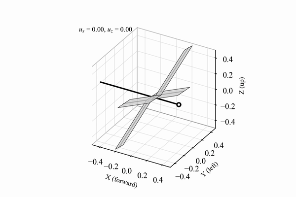
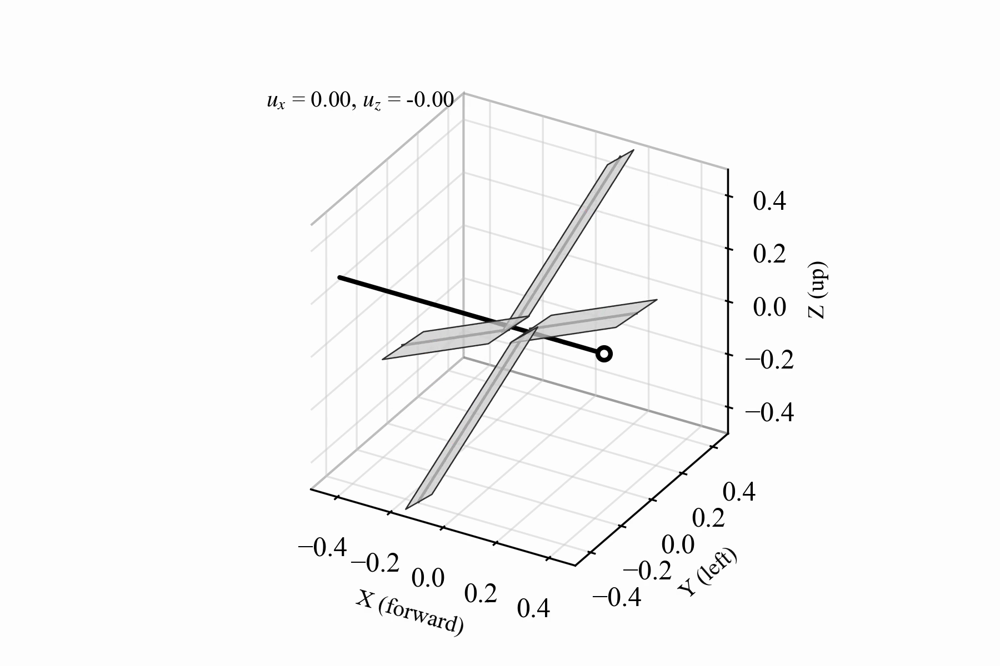
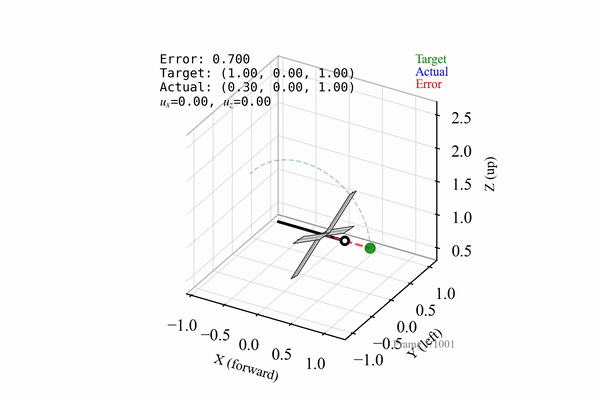
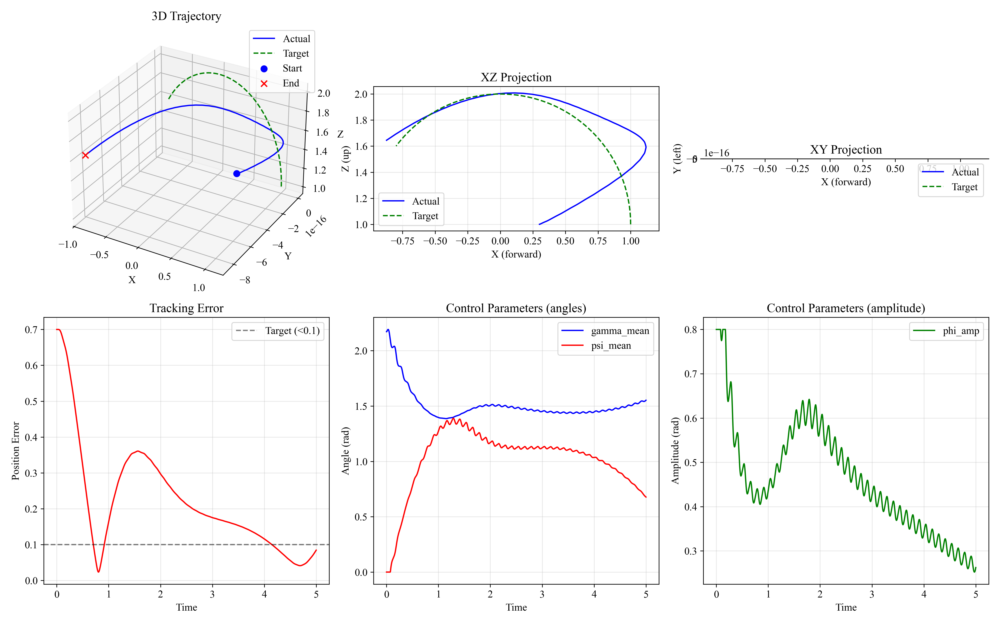
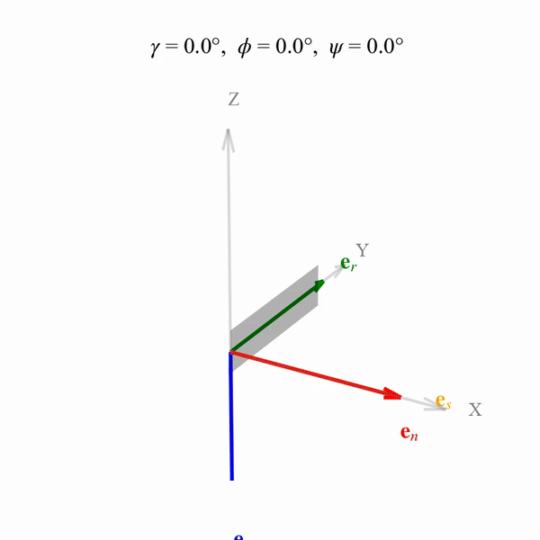

# Dragonfly Flight Control

<!-- TODO: one-paragraph project description -->

<p align="center">
  
</p>

## Building

### Dependencies

- C++17 compiler
- CMake 3.16+
- [Eigen3](https://eigen.tuxfamily.org/)
- [HDF5](https://www.hdfgroup.org/solutions/hdf5/) (C and C++)
- [NLopt](https://github.com/stevengj/nlopt)

[HighFive](https://github.com/BlueBrain/HighFive) is fetched automatically via CMake FetchContent.

### Build

```bash
mkdir -p build && cd build
cmake ..
make
```

### Test

```bash
cd build
ctest
```

## Usage

All simulation modes are accessed through a single `dragonfly` executable:

```
dragonfly <command> [options]

Commands:
  sim      Run flight simulation
  track    Run trajectory tracking simulation
  optim    Find equilibrium flight conditions
  plot     Generate visualization
  wingtest Generate wing rotation test data
  termvel  Compute terminal velocity
```

## Flight Simulation

<!-- TODO: description -->

```bash
dragonfly sim -c configs/sim_hover.cfg
```

<p align="center">
  
</p>

### Config files

| Config | Description |
|--------|-------------|
| `sim_hover.cfg` | Hover flight (4 wings, free flight) |
| `sim_horizontal.cfg` | Horizontal forward flight |
| `sim_inclined.cfg` | Inclined body attitude |
| `sim_figure_eight.cfg` | Figure-eight trajectory |
| `sim_misc.cfg` | General-purpose template |

## Trajectory Tracking

<!-- TODO: description -->

```bash
dragonfly track -c configs/sim_track_circle.cfg
```

<p align="center">
  
</p>

<p align="center">
  
</p>

### Config files

| Config | Description |
|--------|-------------|
| `sim_track_hover.cfg` | PID control to hover at a fixed point |
| `sim_track_circle.cfg` | PID control to track a circular path |

## Equilibrium Optimization

<!-- TODO: description -->

```bash
dragonfly optim -c configs/optim.cfg
```

### Config files

| Config | Description |
|--------|-------------|
| `optim.cfg` | 2-parameter pitch optimization across velocity range |
| `optim_phase_amplitude.cfg` | 4-parameter phase and amplitude study |
| `optim_stroke_plane.cfg` | Stroke plane angle optimization |

### Algorithms

<!-- TODO: brief description of each -->

| Algorithm | Flag | Description |
|-----------|------|-------------|
| COBYLA | `cobyla` | Grid search + local optimizer |
| DIRECT | `direct` | Dividing rectangles global optimizer |
| MLSL | `mlsl` | Multi-level single-linkage |
| CRS2 | `crs2` | Controlled random search |
| Multistart | `multistart` | Sobol sampling + local optimization |

## Visualization

<!-- TODO: description -->

```bash
dragonfly plot -c configs/plot.cfg
```

Rendering uses Blender when available, with a matplotlib fallback. Requires `ffmpeg` for video assembly.

### Python dependencies

```bash
pip install -r requirements.txt
```

### Direct usage

The visualization scripts can also be called directly:

```bash
python -m post.plot_simulation output.h5 animation.mp4 [--no-blender]
python -m post.plot_tracking track.h5 tracking.mp4 [--no-blender]
```

## Wing Kinematics

<!-- TODO: description -->

```bash
dragonfly wingtest --gam 0:90 --phi 0:25 --psi 0:45 -o wingtest.h5
python -m post.plot_wing_rotation wingtest.h5 rotation.mp4
```

<p align="center">
  
</p>

## Terminal Velocity

<!-- TODO: description -->

```bash
dragonfly termvel --psi 45 -o termvel.h5
python -m post.plot_terminal_velocity --psi 45 animation.mp4
```

## Configuration

<!-- TODO: overview of config file format -->

### Kinematic parameters

| Parameter | Description |
|-----------|-------------|
| `omega` | Wing beat frequency (rad/s) |
| `gamma_mean` | Stroke plane angle |
| `gamma_amp` | Stroke plane oscillation amplitude |
| `gamma_phase` | Stroke plane phase offset |
| `phi_amp` | Flapping stroke amplitude |
| `psi_mean` | Mean pitch angle |
| `psi_amp` | Pitch oscillation amplitude |
| `psi_phase` | Pitch phase offset |

### Wing definition

Each wing is defined in a `[[wing]]` block:

```
[[wing]]
name = fore
side = left
mu0 = 0.075
lb0 = 0.75
Cd0 = 0.4
Cl0 = 1.2
phase = 0.0
```

## Output Format

Simulation output is written to HDF5. See [docs/output_format.md](docs/output_format.md) for the full specification.

Coordinate system: right-handed, X = forward, Y = left, Z = up. All quantities nondimensional, angles in radians.

## Project Structure

```
dragonfly-flight-control/
├── apps/           CLI commands (sim, track, optim, plot, wingtest, termvel)
├── src/            Physics engine (aerodynamics, kinematics, integration, control)
├── include/        C++ headers
├── tests/          Unit tests
├── configs/        Simulation config files
├── post/           Python postprocessing and visualization
│   └── blender/    Blender rendering pipeline
├── assets/         Wing meshes (OBJ) and generated media
├── data/           Reference morphological data
└── docs/           Output format specification
```

## License

MIT
