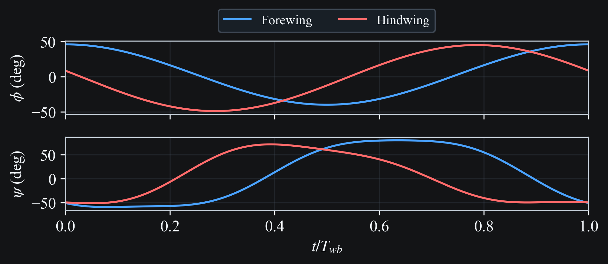
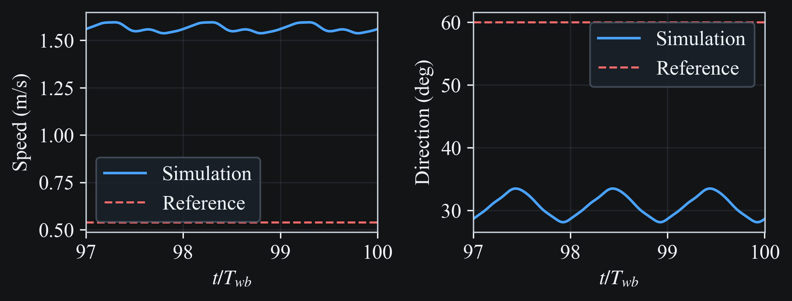

# (Azuma, 1985)

Flight simulation from experimental wing kinematics from {cite}`azuma1985`.

## Description

### Dragonfly Specimen

| Parameter | Dimensions |
|---|---|
| $L$ | $4\times10^{-2}$ m |
| $m$ | $2.6\times10^{-4}$ kg |
| $R_{fw}$ | $3.35\times10^{-2}$ m |
| $S_{fw}$ | $2.21\times10^{-4}$ m$^2$ |
| $AR_{fw}$ | $10.2$ |
| $R_{hw}$ | $3.25\times10^{-2}$ m |
| $S_{hw}$ | $2.72\times10^{-4}$ m$^2$ |
| $AR_{hw}$ | $7.8$ |

### Wing Kinematics

Flapping frequency: $f = 41.5$ Hz

Stroke planes

$$\gamma_{fw} = 37 \text{deg}$$
$$\gamma_{hw} = 40 \text{deg}$$

Wing flapping angle Fourier series (in degrees)

$$\psi_{fw} = -3 - 43 \cos{(\omega t)}$$
$$\psi_{hw} = 2 - 47 \cos{(\omega t + 77)}$$

Wing pitch angle Fourier series (in degrees)

$$\theta_{fw} = 98 - 77 \cos{(\omega t - 49)} - 3 \cos{(2\omega t + 67)} - 8\cos{(3\omega t + 29)}$$
$$\theta_{hw} = 93 - 65 \cos{(\omega t + 18)} + 8 \cos{(2\omega t + 74)} + 8\cos{(3\omega t + 28)}$$

## Artifacts

- {download}`manifest.json <azuma1985/artifacts/manifest.json>`
- {download}`sim_azuma1985.cfg <azuma1985/artifacts/sim/sim_azuma1985.cfg>`
- {download}`translate_summary.json <azuma1985/artifacts/sim/translate_summary.json>`
- {download}`output.h5 <azuma1985/artifacts/sim/output.h5>`
- {download}`simulation.light.mp4 <../_static/media/azuma1985/simulation.light.mp4>`
- {download}`simulation.dark.mp4 <../_static/media/azuma1985/simulation.dark.mp4>`
- {download}`stick.light.mp4 <../_static/media/azuma1985/stick.light.mp4>`
- {download}`stick.dark.mp4 <../_static/media/azuma1985/stick.dark.mp4>`
- {download}`kinematics_inputs.light.png <../_static/media/azuma1985/kinematics_inputs.light.png>`
- {download}`kinematics_inputs.dark.png <../_static/media/azuma1985/kinematics_inputs.dark.png>`
- {download}`motion_mapping.light.png <../_static/media/azuma1985/motion_mapping.light.png>`
- {download}`motion_mapping.dark.png <../_static/media/azuma1985/motion_mapping.dark.png>`
- {download}`flight_metrics.light.png <../_static/media/azuma1985/flight_metrics.light.png>`
- {download}`flight_metrics.dark.png <../_static/media/azuma1985/flight_metrics.dark.png>`

## Pre-processing

### Kinematics Data

The flapping angle $\psi$ and pitch angle $\theta$ below are the Fourier cosine
series from the paper, evaluated over one wingbeat.

```{raw} html

```

### Mapped Simulator Angles (`phi`, `psi`)

The simulator motion inputs are constructed from the paper angles using:

- `phi_sim = -psi_paper` (sign flip)
- `psi_sim = theta_paper - 90 deg`

```{raw} html

```

## Results

### Wing Motion 3D Visualization

```{raw} html
<video
  class="case-study-video"
  controls
  loop
  autoplay
  muted
  preload="metadata"
  data-light-src="../_static/media/azuma1985/simulation.light.mp4"
  data-dark-src="../_static/media/azuma1985/simulation.dark.mp4"
>
  <source src="../_static/media/azuma1985/simulation.dark.mp4" type="video/mp4">
  Your browser does not support the video tag.
</video>
```

### Wing Motion Stick Plot

```{raw} html
<video
  class="case-study-video"
  controls
  loop
  autoplay
  muted
  preload="metadata"
  data-light-src="../_static/media/azuma1985/stick.light.mp4"
  data-dark-src="../_static/media/azuma1985/stick.dark.mp4"
>
  <source src="../_static/media/azuma1985/stick.dark.mp4" type="video/mp4">
  Your browser does not support the video tag.
</video>
```

### Body Speed and Direction vs Experiment

The left panel shows dimensional body speed magnitude from simulation compared to
the experimental reference `0.54 m/s`. The right panel shows the center-of-mass
direction angle in the `XZ` plane, `atan2(z, x)` in degrees, compared to the
experimental reference `60 deg`.

```{raw} html

```

## Config Extract

```{literalinclude} azuma1985/artifacts/sim/sim_azuma1985.cfg
:language: ini
```

## Translation Summary Extract

```{literalinclude} azuma1985/artifacts/sim/translate_summary.json
:language: json
```

## Reproduction Commands

```bash
# Regenerate and sync all Azuma docs media/artifacts
python scripts/update_docs_media.py --only azuma1985_translate_sim azuma1985_animation_light azuma1985_animation_dark azuma1985_stick_light azuma1985_stick_dark azuma1985_kinematics_inputs_light azuma1985_kinematics_inputs_dark azuma1985_motion_mapping_light azuma1985_motion_mapping_dark azuma1985_flight_metrics_light azuma1985_flight_metrics_dark

# Or individual entries
python scripts/update_docs_media.py --only azuma1985_animation_light
python scripts/update_docs_media.py --only azuma1985_animation_dark
python scripts/update_docs_media.py --only azuma1985_stick_light
python scripts/update_docs_media.py --only azuma1985_stick_dark
python scripts/update_docs_media.py --only azuma1985_kinematics_inputs_light
python scripts/update_docs_media.py --only azuma1985_kinematics_inputs_dark
python scripts/update_docs_media.py --only azuma1985_motion_mapping_light
python scripts/update_docs_media.py --only azuma1985_motion_mapping_dark
python scripts/update_docs_media.py --only azuma1985_flight_metrics_light
python scripts/update_docs_media.py --only azuma1985_flight_metrics_dark
```

## References

```{bibliography}
:filter: docname in docnames
```
