# (Azuma, 1988)

Flight simulation from experimental wing kinematics from {cite}`azuma1988`.

This page renders media for experiments `1`-`4` (Dragonfly A/B).

## Description

```{include} generated/azuma1988_description.md
```

## Artifacts

- Experiment 1: {download}`manifest.json <azuma1988/artifacts/exp1/manifest.json>`, {download}`sim_azuma1988.cfg <azuma1988/artifacts/exp1/sim/sim_azuma1988.cfg>`, {download}`translate_summary.json <azuma1988/artifacts/exp1/sim/translate_summary.json>`, {download}`output.h5 <azuma1988/artifacts/exp1/sim/output.h5>`
- Experiment 2: {download}`manifest.json <azuma1988/artifacts/exp2/manifest.json>`, {download}`sim_azuma1988.cfg <azuma1988/artifacts/exp2/sim/sim_azuma1988.cfg>`, {download}`translate_summary.json <azuma1988/artifacts/exp2/sim/translate_summary.json>`, {download}`output.h5 <azuma1988/artifacts/exp2/sim/output.h5>`
- Experiment 3: {download}`manifest.json <azuma1988/artifacts/exp3/manifest.json>`, {download}`sim_azuma1988.cfg <azuma1988/artifacts/exp3/sim/sim_azuma1988.cfg>`, {download}`translate_summary.json <azuma1988/artifacts/exp3/sim/translate_summary.json>`, {download}`output.h5 <azuma1988/artifacts/exp3/sim/output.h5>`
- Experiment 4: {download}`manifest.json <azuma1988/artifacts/exp4/manifest.json>`, {download}`sim_azuma1988.cfg <azuma1988/artifacts/exp4/sim/sim_azuma1988.cfg>`, {download}`translate_summary.json <azuma1988/artifacts/exp4/sim/translate_summary.json>`, {download}`output.h5 <azuma1988/artifacts/exp4/sim/output.h5>`

## Pre-processing

The simulator motion inputs are constructed from the paper angles using:

- `phi_sim = -psi_paper` (sign flip)
- `psi_sim = theta_paper - 90 deg`

## Experiment 1 (Dragonfly A)

### Kinematics Data

```{raw} html
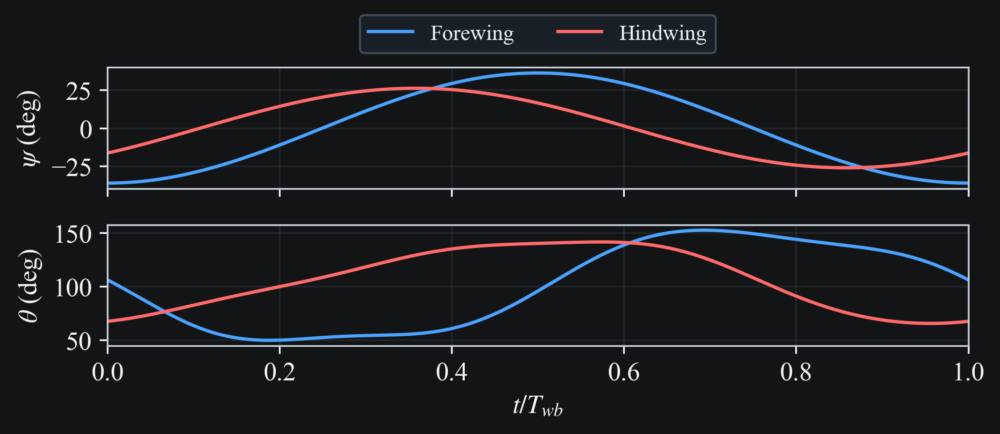
```

### Mapped Simulator Angles (`phi`, `psi`)

```{raw} html
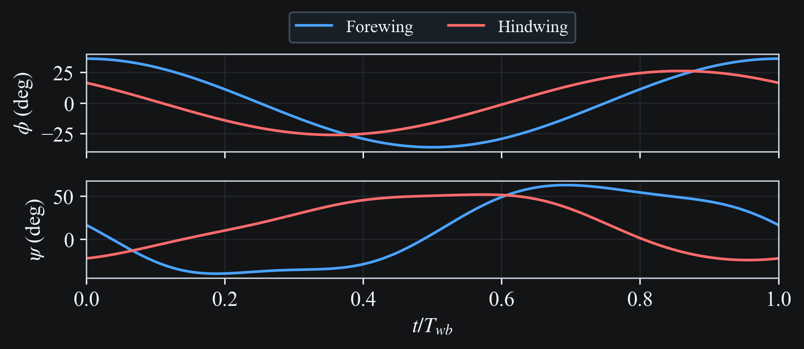
```

### Wing Motion 3D Visualization

```{raw} html
<video
  class="case-study-video"
  controls
  loop
  autoplay
  muted
  preload="metadata"
  data-light-src="../_static/media/azuma1988/exp1/simulation.light.mp4"
  data-dark-src="../_static/media/azuma1988/exp1/simulation.dark.mp4"
>
  <source src="../_static/media/azuma1988/exp1/simulation.dark.mp4" type="video/mp4">
  Your browser does not support the video tag.
</video>
```

### Wing Motion Stick Plot

```{raw} html
<video
  class="case-study-video"
  controls
  loop
  autoplay
  muted
  preload="metadata"
  data-light-src="../_static/media/azuma1988/exp1/stick.light.mp4"
  data-dark-src="../_static/media/azuma1988/exp1/stick.dark.mp4"
>
  <source src="../_static/media/azuma1988/exp1/stick.dark.mp4" type="video/mp4">
  Your browser does not support the video tag.
</video>
```

### Body Speed and Direction

```{raw} html
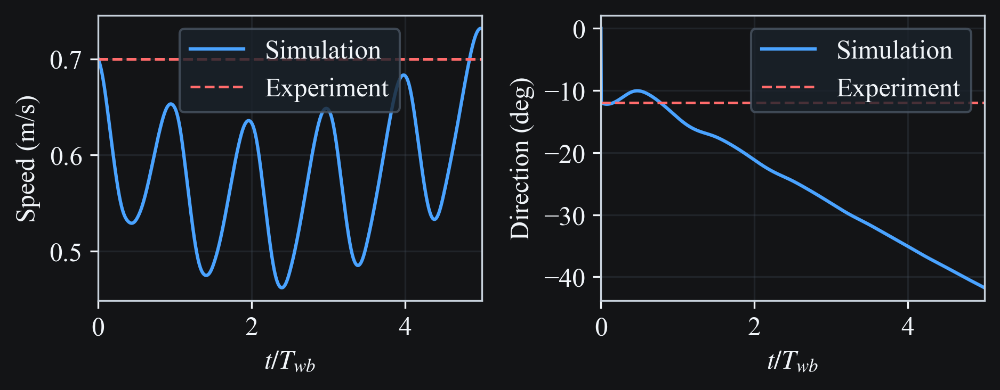
```

### Vertical Force vs Blade Segments (One Wingbeat, Fixed Body Velocity)

```{raw} html
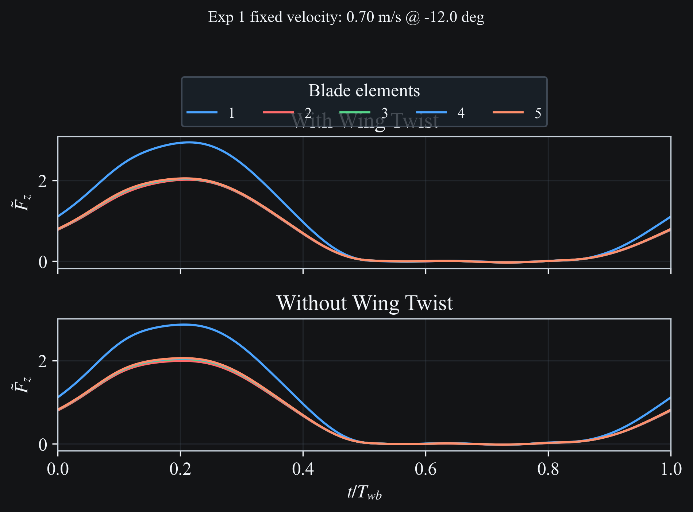
```

## Experiment 2 (Dragonfly A)

### Kinematics Data

```{raw} html
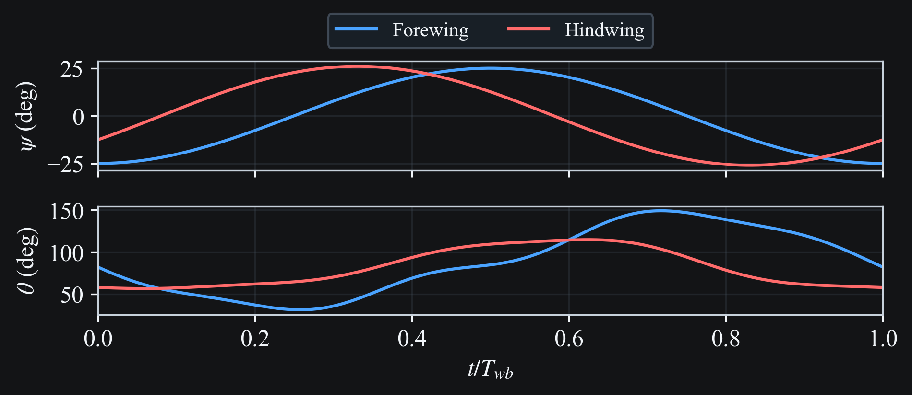
```

### Mapped Simulator Angles (`phi`, `psi`)

```{raw} html
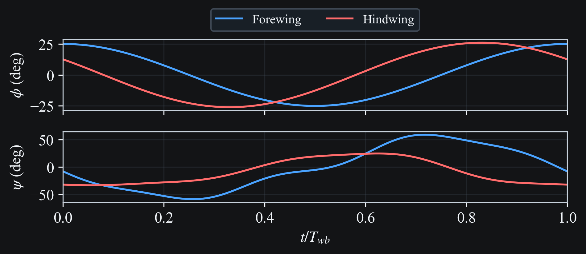
```

### Wing Motion 3D Visualization

```{raw} html
<video
  class="case-study-video"
  controls
  loop
  autoplay
  muted
  preload="metadata"
  data-light-src="../_static/media/azuma1988/exp2/simulation.light.mp4"
  data-dark-src="../_static/media/azuma1988/exp2/simulation.dark.mp4"
>
  <source src="../_static/media/azuma1988/exp2/simulation.dark.mp4" type="video/mp4">
  Your browser does not support the video tag.
</video>
```

### Wing Motion Stick Plot

```{raw} html
<video
  class="case-study-video"
  controls
  loop
  autoplay
  muted
  preload="metadata"
  data-light-src="../_static/media/azuma1988/exp2/stick.light.mp4"
  data-dark-src="../_static/media/azuma1988/exp2/stick.dark.mp4"
>
  <source src="../_static/media/azuma1988/exp2/stick.dark.mp4" type="video/mp4">
  Your browser does not support the video tag.
</video>
```

### Body Speed and Direction

```{raw} html

```

## Experiment 3 (Dragonfly A)

### Kinematics Data

```{raw} html
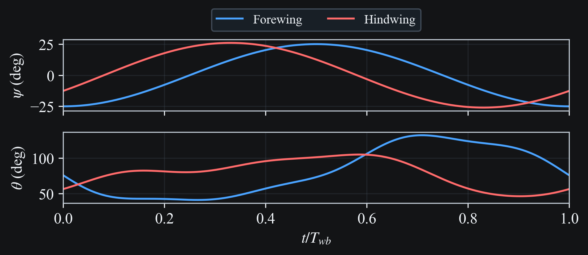
```

### Mapped Simulator Angles (`phi`, `psi`)

```{raw} html

```

### Wing Motion 3D Visualization

```{raw} html
<video
  class="case-study-video"
  controls
  loop
  autoplay
  muted
  preload="metadata"
  data-light-src="../_static/media/azuma1988/exp3/simulation.light.mp4"
  data-dark-src="../_static/media/azuma1988/exp3/simulation.dark.mp4"
>
  <source src="../_static/media/azuma1988/exp3/simulation.dark.mp4" type="video/mp4">
  Your browser does not support the video tag.
</video>
```

### Wing Motion Stick Plot

```{raw} html
<video
  class="case-study-video"
  controls
  loop
  autoplay
  muted
  preload="metadata"
  data-light-src="../_static/media/azuma1988/exp3/stick.light.mp4"
  data-dark-src="../_static/media/azuma1988/exp3/stick.dark.mp4"
>
  <source src="../_static/media/azuma1988/exp3/stick.dark.mp4" type="video/mp4">
  Your browser does not support the video tag.
</video>
```

### Body Speed and Direction

```{raw} html
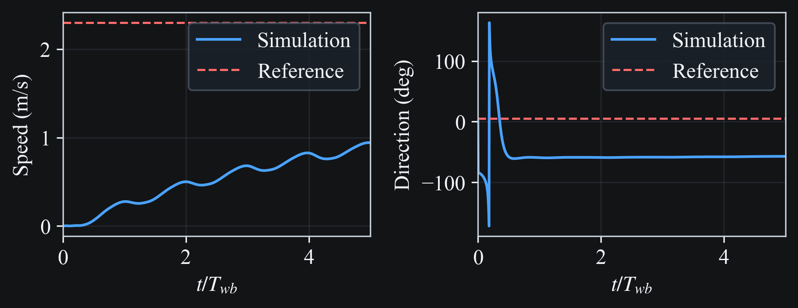
```

## Experiment 4 (Dragonfly B)

### Kinematics Data

```{raw} html
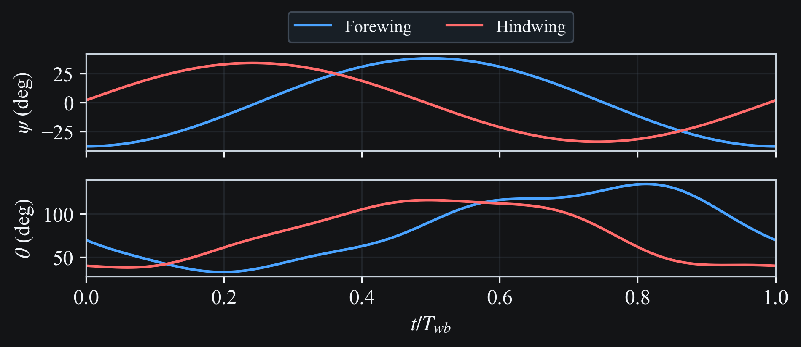
```

### Mapped Simulator Angles (`phi`, `psi`)

```{raw} html
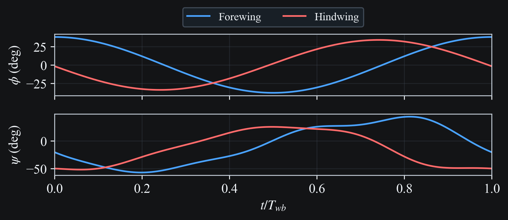
```

### Wing Motion 3D Visualization

```{raw} html
<video
  class="case-study-video"
  controls
  loop
  autoplay
  muted
  preload="metadata"
  data-light-src="../_static/media/azuma1988/exp4/simulation.light.mp4"
  data-dark-src="../_static/media/azuma1988/exp4/simulation.dark.mp4"
>
  <source src="../_static/media/azuma1988/exp4/simulation.dark.mp4" type="video/mp4">
  Your browser does not support the video tag.
</video>
```

### Wing Motion Stick Plot

```{raw} html
<video
  class="case-study-video"
  controls
  loop
  autoplay
  muted
  preload="metadata"
  data-light-src="../_static/media/azuma1988/exp4/stick.light.mp4"
  data-dark-src="../_static/media/azuma1988/exp4/stick.dark.mp4"
>
  <source src="../_static/media/azuma1988/exp4/stick.dark.mp4" type="video/mp4">
  Your browser does not support the video tag.
</video>
```

### Body Speed and Direction

```{raw} html
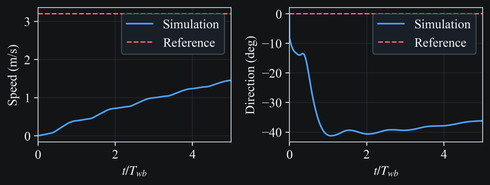
```

### Angle of Attack Along Span and Wingbeat

Angle of attack over one wingbeat of constant-velocity flight, viewed normal to
the stroke plane, for the forewing (above) and hindwing (below)

```{raw} html
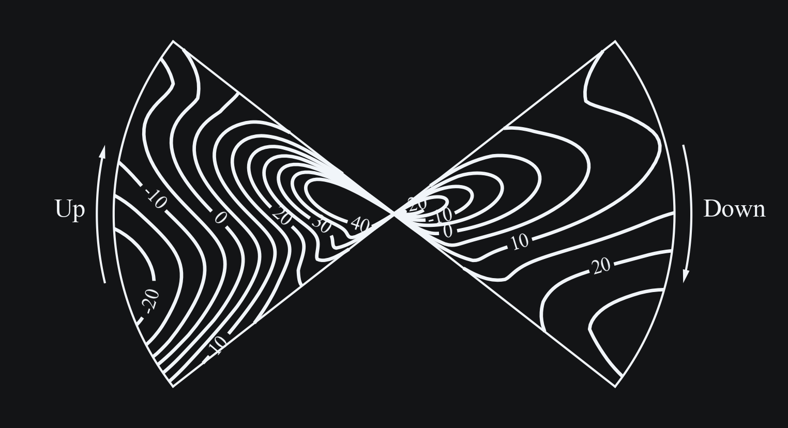
```

```{raw} html
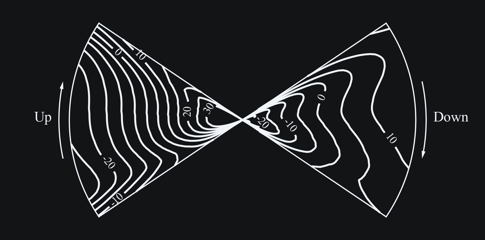
```

### Pitch Angle Along Span and Wingbeat

Pitch angle over one wingbeat of constant-velocity flight, viewed normal to the
stroke plane, for the forewing (above) and hindwing (below)

```{raw} html
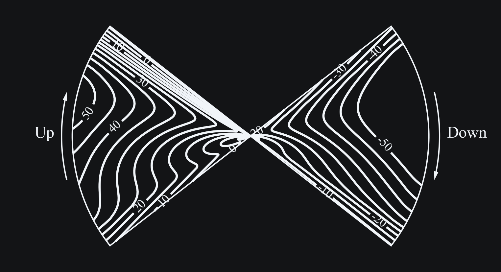
```

```{raw} html
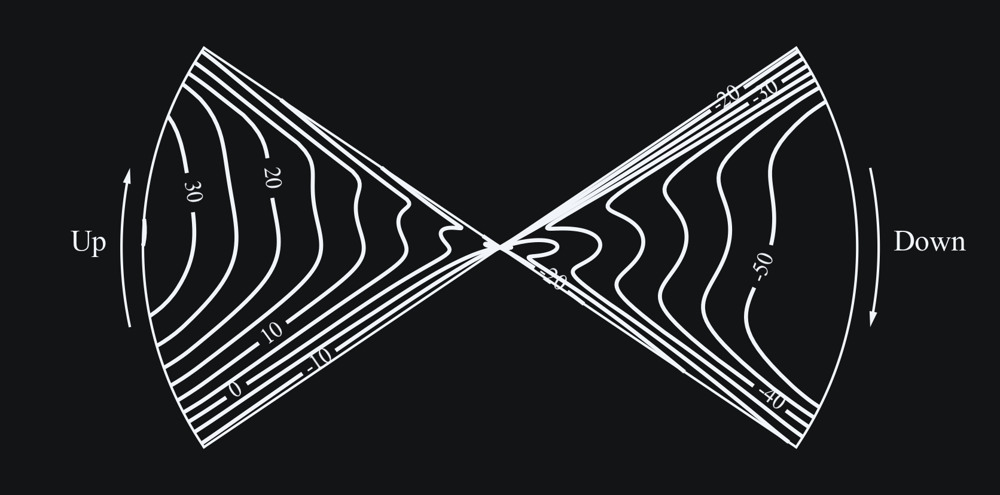
```

## Config Extract (Experiment 1)

```{literalinclude} azuma1988/artifacts/exp1/sim/sim_azuma1988.cfg
:language: ini
```

## Translation Summary Extract (Experiment 1)

```{literalinclude} azuma1988/artifacts/exp1/sim/translate_summary.json
:language: json
```

## Reproduction Commands

```bash
# Regenerate and sync all Azuma 1988 experiments/media
python scripts/update_docs_media.py --only azuma1988

# Or one experiment at a time
python scripts/update_docs_media.py --only azuma1988_exp1
python scripts/update_docs_media.py --only azuma1988_exp2
python scripts/update_docs_media.py --only azuma1988_exp3
python scripts/update_docs_media.py --only azuma1988_exp4

# Direct pipeline execution (choose experiment id)
python scripts/azuma1988_pipeline.py all --run-dir runs/azuma1988/exp2 --experiment 2
```

## References

```{bibliography}
:filter: docname in docnames
```
