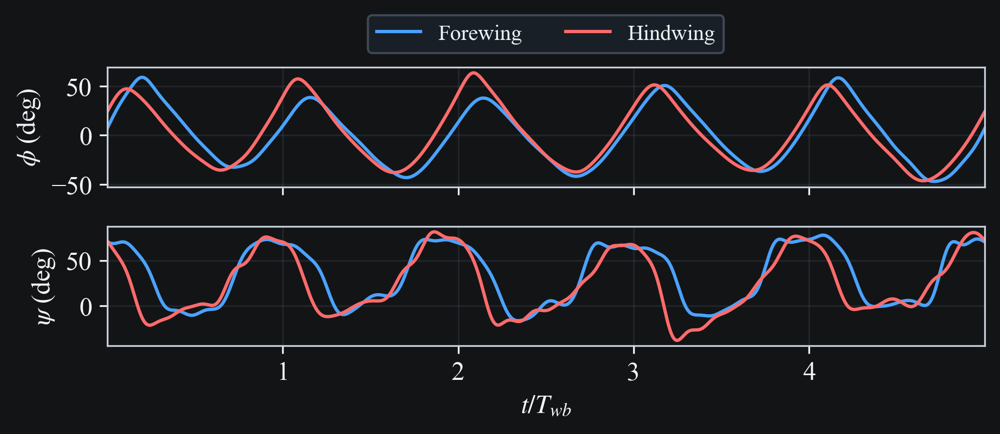

# (Wang, 2007)

This case study runs tethered simulations using wing kinematics derived from {cite}`wang2007`.
A high-fidelity Fourier representation using 7 harmonics per wingbeat
(35 Fourier components over 5 wingbeats) is compared to a single harmonic representation.

Pipeline stages: `sim -> post`

## Key Parameters

- `omega`: `14.982242894657686`
- `lb0`: `0.8`
- `mu0`: `0.06533333333333334`
- `harmonics_per_wingbeat`: `7`
- `fourier_components`: `35`
- `n_wingbeats`: `5`
- `steps_per_wingbeat`: `200`

## Artifacts

### Sim Stage

- {download}`sim_wang2007_7harm.cfg <wang2007/artifacts/sim/sim_wang2007_7harm.cfg>`
- {download}`sim_wang2007_1harm.cfg <wang2007/artifacts/sim/sim_wang2007_1harm.cfg>`
- {download}`output_7harm.h5 <wang2007/artifacts/sim/output_7harm.h5>`
- {download}`output_1harm.h5 <wang2007/artifacts/sim/output_1harm.h5>`

### Post Stage

- {download}`simulation.light.mp4 <../_static/media/wang2007/simulation.light.mp4>`
- {download}`simulation.dark.mp4 <../_static/media/wang2007/simulation.dark.mp4>`
- {download}`stroke_fore_left.light.mp4 <../_static/media/wang2007/stroke_fore_left.light.mp4>`
- {download}`stroke_fore_left.dark.mp4 <../_static/media/wang2007/stroke_fore_left.dark.mp4>`
- {download}`kinematics_inputs.light.png <../_static/media/wang2007/kinematics_inputs.light.png>`
- {download}`kinematics_inputs.dark.png <../_static/media/wang2007/kinematics_inputs.dark.png>`
- {download}`motion_mapping.light.png <../_static/media/wang2007/motion_mapping.light.png>`
- {download}`motion_mapping.dark.png <../_static/media/wang2007/motion_mapping.dark.png>`
- {download}`force_comparison.light.png <../_static/media/wang2007/force_comparison.light.png>`
- {download}`force_comparison.dark.png <../_static/media/wang2007/force_comparison.dark.png>`

## Pre-processing

### Kinematics Data

The `s`, `d`, and `beta` traces below are the Fourier-smoothed inputs
used to build the high-fidelity (35-component) wing kinematics.

```{raw} html

```

### Mapped Simulator Angles (`phi`, `psi`)

The simulator motion inputs are constructed from the smoothed traces using:

- `phi = arcsin(s / r)`
- `psi = pi/2 - beta`

```{raw} html

```

## Results

### Wing Motion 3D Visualization

```{raw} html
<video
  class="case-study-video"
  controls
  loop
  autoplay
  muted
  preload="metadata"
  data-light-src="../_static/media/wang2007/simulation.light.mp4"
  data-dark-src="../_static/media/wang2007/simulation.dark.mp4"
>
  <source src="../_static/media/wang2007/simulation.dark.mp4" type="video/mp4">
  Your browser does not support the video tag.
</video>
```

### Wing Motion Stick Plot

```{raw} html
<video
  class="case-study-video"
  controls
  loop
  autoplay
  muted
  preload="metadata"
  data-light-src="../_static/media/wang2007/stroke_fore_left.light.mp4"
  data-dark-src="../_static/media/wang2007/stroke_fore_left.dark.mp4"
>
  <source src="../_static/media/wang2007/stroke_fore_left.dark.mp4" type="video/mp4">
  Your browser does not support the video tag.
</video>
```

### Force Comparison

The plot overlays simulation force traces with the external CFD reference from
`data/kinematics/wang2007/cfd_data.csv`.

```{raw} html

```

## Config Extract (High-Fidelity Run)

```{literalinclude} wang2007/artifacts/sim/sim_wang2007_7harm.cfg
:language: ini
```

## Reproduction Commands

```bash
# Regenerate and sync all Wang docs media/artifacts
python scripts/update_docs_media.py

# Or only one themed animation entry
python scripts/update_docs_media.py --only wang2007_animation_light
python scripts/update_docs_media.py --only wang2007_animation_dark

# Or only force comparison theme variants
python scripts/update_docs_media.py --only wang2007_force_comparison_light
python scripts/update_docs_media.py --only wang2007_force_comparison_dark

# Or only smoothed input-kinematics theme variants
python scripts/update_docs_media.py --only wang2007_kinematics_inputs_light
python scripts/update_docs_media.py --only wang2007_kinematics_inputs_dark

# Or only mapped simulator-angle theme variants
python scripts/update_docs_media.py --only wang2007_motion_mapping_light
python scripts/update_docs_media.py --only wang2007_motion_mapping_dark
```

## References

```{bibliography}
:filter: docname in docnames
```
