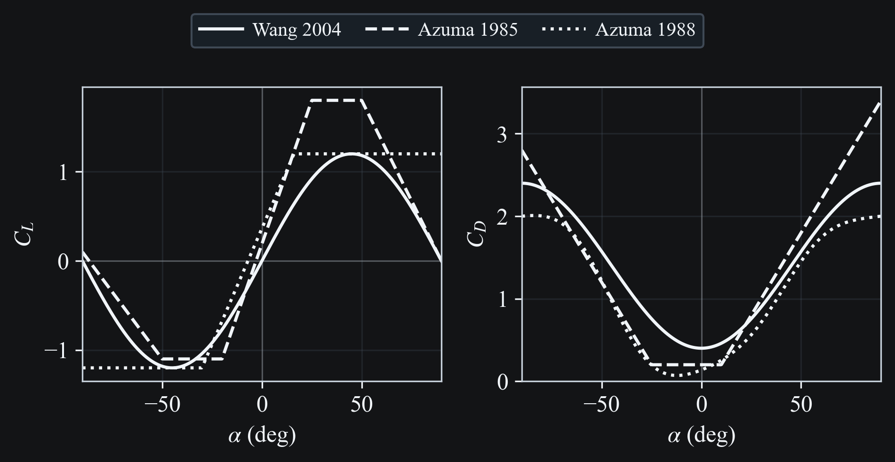

# Blade Elements

## Overview

Aerodynamic forces are computed with a blade-element model. Each wing is discretized into a set of spanwise blade elements, and the aerodynamic force is evaluated at the aerodynamic center of each element. The total wing force is the sum of the blade-element contributions.

## Velocity And Angle Of Attack

At a span station $\eta \in [0,1]$ with radius vector $\mathbf{r} = \eta R \mathbf{e}_r$, the local wing velocity in the inertial frame is modeled as

$$
\mathbf{u}_w = \mathbf{u}_b + \mathbf{v}_{\phi} + \mathbf{v}_{\beta}
$$

where $\mathbf{u}_b$ is the body velocity, $\mathbf{v}_{\phi}$ is the flapping contribution, inside the stroke plane, and $\mathbf{v}_{\beta}$ is the coning angle contribution normal to the stroke plane. The velocity used for aerodynamic loading is the component normal to the spanwise direction:

$$
\mathbf{u} = \mathbf{u}_w - (\mathbf{u}_w \cdot \mathbf{e}_r)\mathbf{e}_r
$$

The angle of attack is then defined by the signed angle from the chord direction $\mathbf{e}_c$ to the projected velocity $\mathbf{u}$ about the local span axis $\mathbf{e}_r$:

$$
\alpha = \tan^{-1} \left(\frac{(\mathbf{u} \times \mathbf{e}_c)\cdot\mathbf{e}_r}{\mathbf{u}\cdot\mathbf{e}_c}\right)
$$

## Aerodynamic Coefficients

For each blade element, drag and lift coefficients are evaluated from the configured coefficient model using the local angle of attack $\alpha$. Several aerodynamic coefficient models can be selected. The blade-element force vectors are then accumulated into total wing lift and drag.

```{raw} html
<div style="margin-bottom:1.5rem; margin-top:1.0rem;">
  
  <div style="font-size:0.85em; line-height:1.2; margin-top:0.3rem; text-align:center;">Fig. 1. Lift and drag coefficients vs. angle of attack for built-in coefficient sets.</div>
</div>
```

## Spanwise Discretization

Each wing is divided into $N$ bins along the normalized span coordinate $\eta$. The wings are assumed to have an elliptical surface area distribution, such that the chord weighting at $\eta$ is

$$
w(\eta) \propto \sqrt{1 - (2\eta - 1)^2}, \quad \eta \in [0,1]
$$

For a blade-element bin $\eta \in [a,b]$, the representative station is the chord centroid

$$
\eta_c = \frac{\int_a^b \eta\, w(\eta)\, d\eta}{\int_a^b w(\eta)\, d\eta}
$$

The implementation evaluates these integrals analytically (not numerically) using the change of variables $x = 2\eta - 1$, which reduces them to semicircle integrals over $x \in [-1,1]$. The same bin integral is also used to form the blade-element area weights for force accumulation, so the quadrature locations and weights are consistent.

## References

```{bibliography}
:filter: docname in docnames
```
