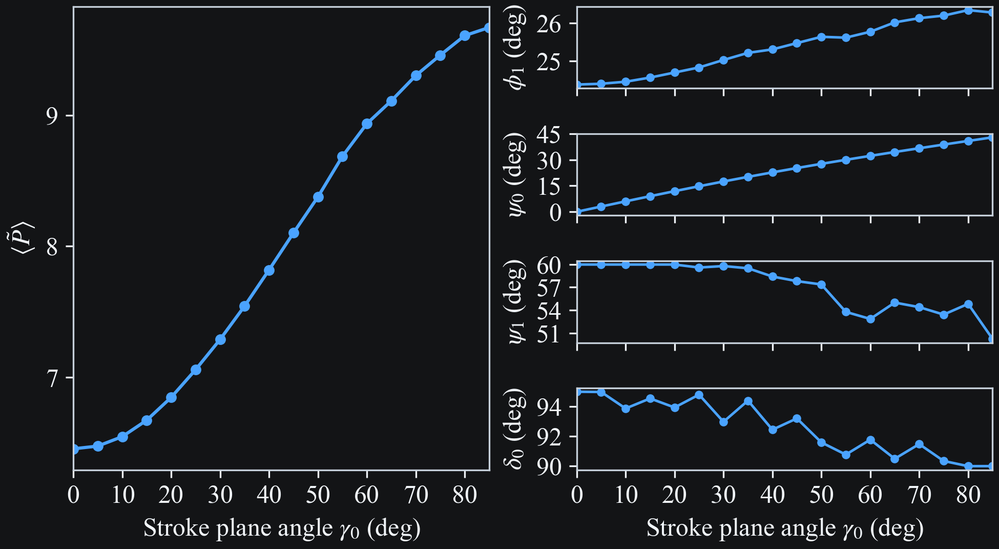
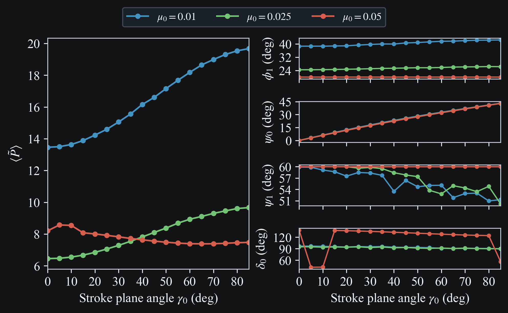
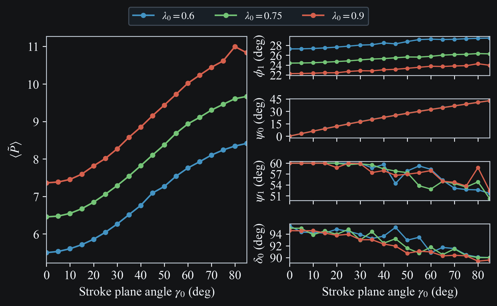
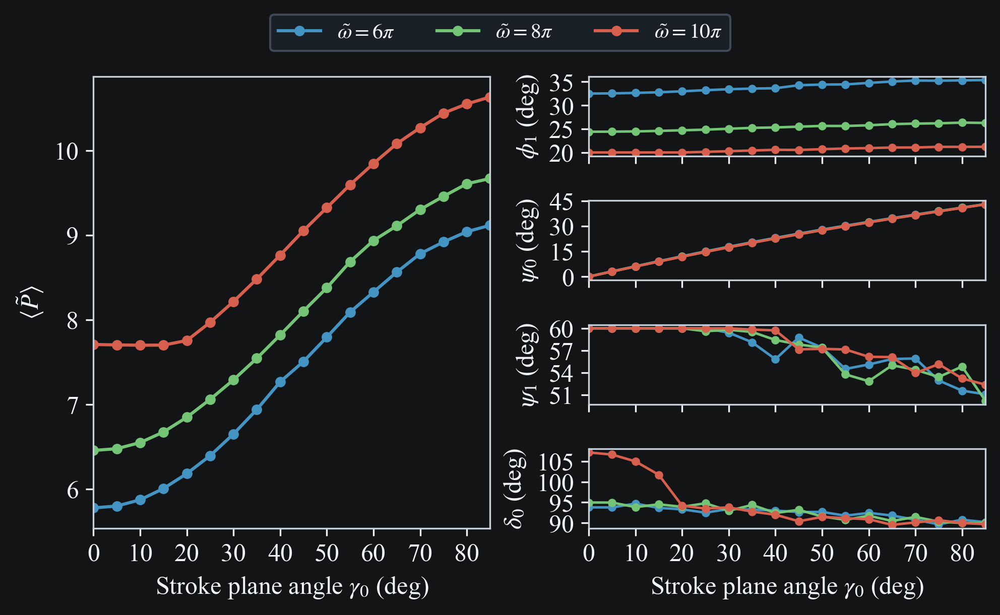
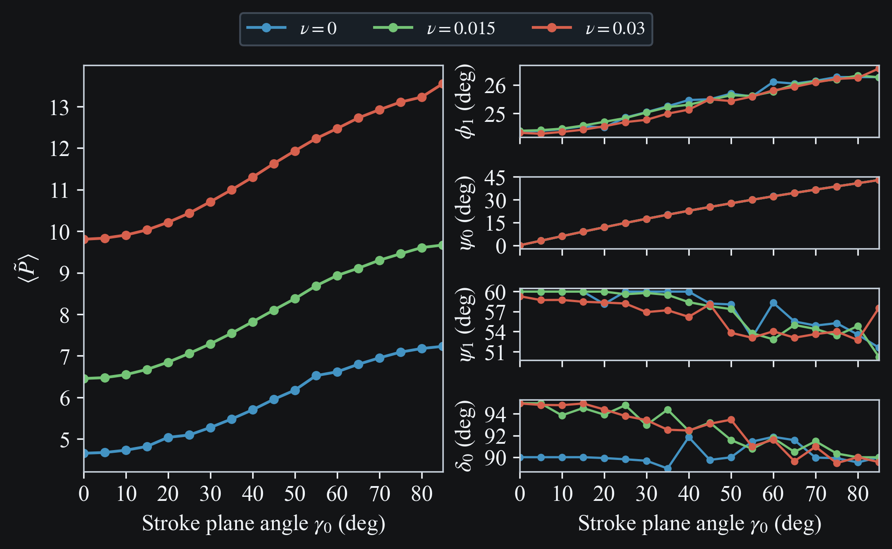

# Hover Problem

## Motivation

Before tackling relatively complex flight regimes, like pursuit of a prey, or dynamic soaring, we start with the simplest, which is static hovering. In this flight regime, the dragonfly beats its wings such that the mean aerodynamic force over a wingbeat exactly balances gravity, to maintain a fixed position in space.

The simplest solution to the hover problem is a horizontal stroke plane with a symmetric wingstroke such that the lift points up, and the side-to-side drag cancels itself out over a wingbeat. Dragonflies, on the other hand, use asymmetric up- and downstrokes along an inclined stroke plane, such that the upward force is largely generated during the downstroke {cite}`wang2005`.

Our objective is to develop a wing control scheme to achieve hovering, and to evaluate the robustness of this control scheme in the face of external perturbations, i.e. wind, and non-zero initial body velocities. First, we use an optimization routine to find power-minimizing hover solutions that are hopefully representative of real dragonfly hover. Informed by the results, we develop a wing control scheme for hovering.

## Power-minimizing Hover Solution

### Approach

We solve for the power-minimizing hover kinematics over the stroke plane angle range $\gamma \in [0^\circ, 90^\circ]$. We assume single-harmonic wing motion, with the wings flapping about the horizontal plane ($\phi_0 = 0$). We set the forewing coning angle to $10^\circ$ and the hindwing coning angle to $-10^\circ$. In addition, there are three nondimensional parameters: $\mu_0$ describes the ratio of air mass displaced by the wings to the body mass, $\lambda_0$ describes the ratio of wing length to body length, and $\tilde{\omega}$ is the nondimensional wingbeat frequency. In general, $\mu_0$ and $\lambda_0$ may be different for the fore- and hindwings --- here we assume they are equal. The reference values we use for those parameters are $\mu_0 = 0.025$, $\lambda_0 = 0.75$, and $\tilde{\omega} = 8\pi$. We study the influence of those parameters on the hover kinematics and the power expended. With $\gamma$ and $\beta$ set to the prescribed values, the remaining wing control parameters are:

 - $\phi_1$: flapping amplitude
 - $\psi_0$: mean pitch angle
 - $\psi_1$: pitch amplitude
 - $\delta_0$: phase lead of pitch motion relative to flapping motion

The optimization works in two phases. First we run a multi-start minimization of the mean acceleration $\langle\tilde{\mathbf{a}}\rangle^2$, which includes aerodynamic forces and gravity, at $(u_x, u_z) = (0, 0)$. The zero velocity condition is assumed to hold over the full wingbeat. We are effectively neglecting the small amplitude motion about the hover point due to the unsteady nature of the aerodynamic forces. Second, for each equilibrium found, we minimize the mean power $\langle\tilde{P}\rangle$ subject to $\langle\tilde{\mathbf{a}}\rangle^2 \leq \varepsilon^2$, and keep the solution with the lowest $\langle\tilde{P}\rangle$.

The mean muscular power $\langle \tilde{P} \rangle$ is defined as

$$\langle\tilde{P}\rangle = \frac{1}{\tilde{T}_{wb}}\int_0^{\tilde{T}_\text{wb}} \sum_{i=1}^{n_\text{wings}} \max\!\Big(0,\; \tilde{I}_{\phi,i}\,\ddot{\phi}_i\,\dot{\phi}_i + \tilde{I}_{\psi,i}\,\ddot{\psi}_i\,\dot{\psi}_i - \tilde{\mathbf{F}}_i \cdot \tilde{\mathbf{v}}_{i}\Big)\, dt$$

where $\tilde{I}_{\phi,i}$ and $\tilde{I}_{\psi,i}$ are the nondimensional flapping and pitching moments of inertia of wing $i$, $\dot{\phi}_i$ and $\ddot{\phi}_i$ are its flapping angular velocity and acceleration, $\dot{\psi}_i$ and $\ddot{\psi}_i$ are its pitching angular velocity and acceleration, $\tilde{\mathbf{F}}_i$ is the aerodynamic force on wing $i$, and $\tilde{\mathbf{v}}_i$ is its flapping velocity (excluding the body velocity component). The $\max(0, \cdot)$ operator clamps negative muscular power to zero, assuming perfect elastic energy storage {cite}`berman2007`.

## Results

### Reference Parameters

```{raw} html
<div style="margin-bottom:1.5rem;">
  
  <div style="font-size:0.85em; line-height:1.2; margin-top:0.3rem; text-align:center;">Fig. 1. Left: minimum muscular power as a function of stroke plane angle $\gamma_0$ (dashed line marks the power-minimizing angle). Right: optimal control parameters $\phi_1$, $\psi_0$, $\psi_1$, $\delta_0$.</div>
</div>
```

### Parametric Study

#### Mass ratio $\mu_0$

```{raw} html
<div style="margin-bottom:1.5rem;">
  
  <div style="font-size:0.85em; line-height:1.2; margin-top:0.3rem; text-align:center;">Fig. 2. Effect of aerodynamic loading parameter $\mu_0$.</div>
</div>
```

#### Length ratio $\lambda_0$

```{raw} html
<div style="margin-bottom:1.5rem;">
  
  <div style="font-size:0.85em; line-height:1.2; margin-top:0.3rem; text-align:center;">Fig. 3. Effect of wing span ratio $\lambda_0$.</div>
</div>
```

#### Nondimensional frequency $\tilde{\omega}$

```{raw} html
<div style="margin-bottom:1.5rem;">
  
  <div style="font-size:0.85em; line-height:1.2; margin-top:0.3rem; text-align:center;">Fig. 4. Effect of wingbeat frequency $\tilde{\omega}$.</div>
</div>
```

#### Wing mass fraction $\nu$

```{raw} html
<div style="margin-bottom:1.5rem;">
  
  <div style="font-size:0.85em; line-height:1.2; margin-top:0.3rem; text-align:center;">Fig. 5. Effect of wing mass fraction $\nu$.</div>
</div>
```

### Hover Kinematics

#### Regular ($\delta_0 \approx 90^\circ$)

```{raw} html
<div style="margin-bottom:1.5rem;">
  <video
    class="case-study-video"
    loop
    autoplay
    muted
    playsinline
    preload="metadata"
    data-light-src="../_static/media/hover/hover_stick_ref.light.mp4"
    data-dark-src="../_static/media/hover/hover_stick_ref.dark.mp4"
  >
    <source src="../_static/media/hover/hover_stick_ref.dark.mp4" type="video/mp4">
    Your browser does not support the video tag.
  </video>
  <div style="font-size:0.85em; line-height:1.2; margin-top:0.3rem; text-align:center;">Fig. 6. Hover kinematics at $\gamma_0 = 30°$ with reference parameters ($\mu_0 = 0.025$).</div>
</div>
```

#### High $\mu_0$ ($\delta_0 \approx 135^\circ$)

```{raw} html
<div style="margin-bottom:1.5rem;">
  <video
    class="case-study-video"
    loop
    autoplay
    muted
    playsinline
    preload="metadata"
    data-light-src="../_static/media/hover/hover_stick_high_mu.light.mp4"
    data-dark-src="../_static/media/hover/hover_stick_high_mu.dark.mp4"
  >
    <source src="../_static/media/hover/hover_stick_high_mu.dark.mp4" type="video/mp4">
    Your browser does not support the video tag.
  </video>
  <div style="font-size:0.85em; line-height:1.2; margin-top:0.3rem; text-align:center;">Fig. 7. Hover kinematics at $\gamma_0 = 30°$ with high aerodynamic loading ($\mu_0 = 0.05$).</div>
</div>
```

## Proportional hover controller

### Formulation

The optimizer results suggest a simple control scheme for hover stabilization:

1. Fixed $\gamma_0$, minimum allowed by anatomical constraints to minimize expended power
2. $\phi_1$ controls $\tilde{u}_z$: proportional feedback, $\phi_1 = \phi_{1,\text{eq}} - K_z \, \bar{u}_z$
3. $\psi_0$ controls $\tilde{u}_x$: proportional feedback, $\psi_0 = \psi_{0,\text{eq}} + K_x \, \bar{u}_x$
4. Fixed $\psi_1$ at 60° (near-constant across all $\gamma_0$)
5. Fixed $\delta_0$ at 90° (also nearly constant)

The equilibrium setpoints $\phi_{1,\text{eq}}$ and $\psi_{0,\text{eq}}$ are found by the optimizer at the chosen $\gamma_0$. The controller then regulates the body velocity to zero using only two control channels. The velocity input is averaged over half a wingbeat. To take into account the finite muscle actuation time, the effective wing control parameters track the commanded values with a first-order lag with time constant $\tau$.

### Results

```{raw} html
<div style="margin-bottom:1.5rem;">
  
  <div style="font-size:0.85em; line-height:1.2; margin-top:0.3rem; text-align:center;">Fig. 8. Hover stabilization from $(u_x, u_z) = (2.0, -1.0)$. Top: body velocity (within-wingbeat oscillations are physical). Bottom: control inputs $\phi_1$ and $\psi_0$ with dotted equilibrium lines. Parameters: $K_z = 0.7$, $K_x = 1.2$, averaging window $= 0.5\,T_\text{wb}$, muscle lag $\tau = 0.5\,T_\text{wb}$.</div>
</div>
```

```{raw} html
<div style="margin-bottom:1.5rem;">
  <video
    class="case-study-video"
    loop
    autoplay
    muted
    playsinline
    preload="metadata"
    data-light-src="../_static/media/hover/hover_control.light.mp4"
    data-dark-src="../_static/media/hover/hover_control.dark.mp4"
  >
    <source src="../_static/media/hover/hover_control.dark.mp4" type="video/mp4">
    Your browser does not support the video tag.
  </video>
  <div style="font-size:0.85em; line-height:1.2; margin-top:0.3rem; text-align:center;">Fig. 9. 3D animation of hover stabilization. The dragonfly starts with initial velocity $(u_x, u_z) = (2.0, -1.0)$ and converges to hover within ~30 wingbeats.</div>
</div>
```

## References

```{bibliography}
:filter: docname in docnames
```
