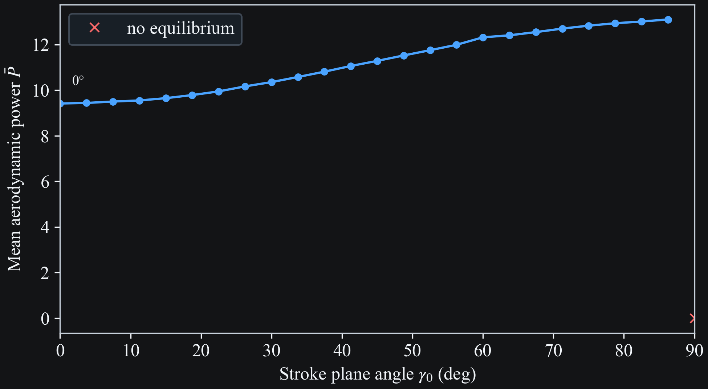
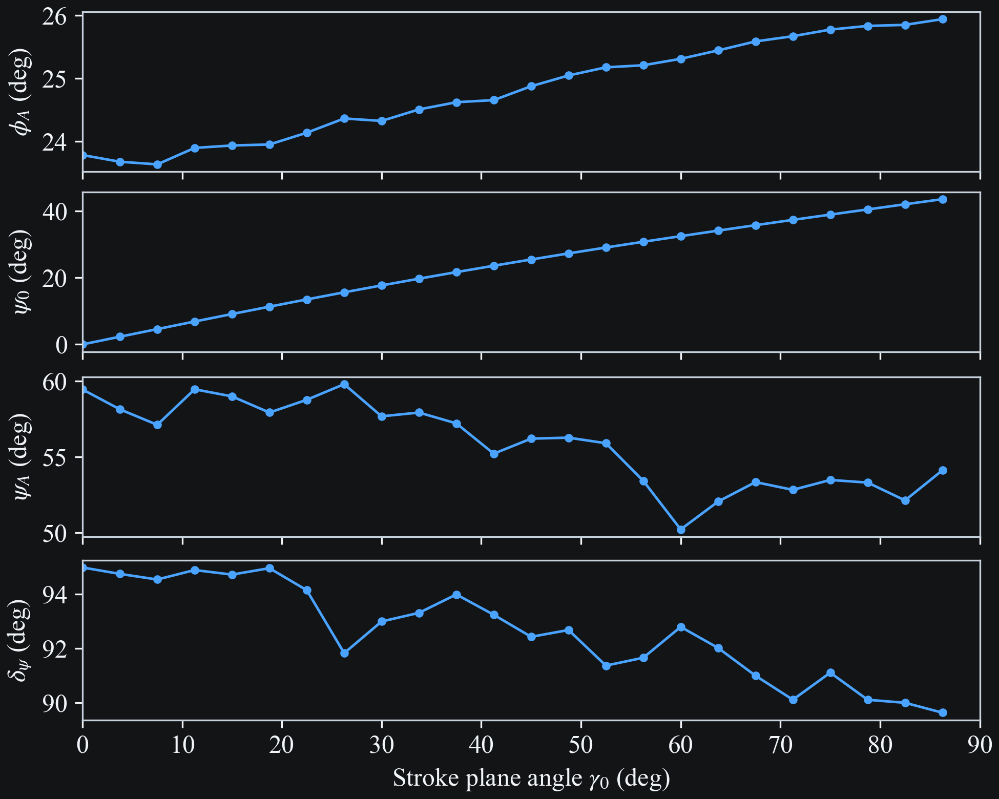
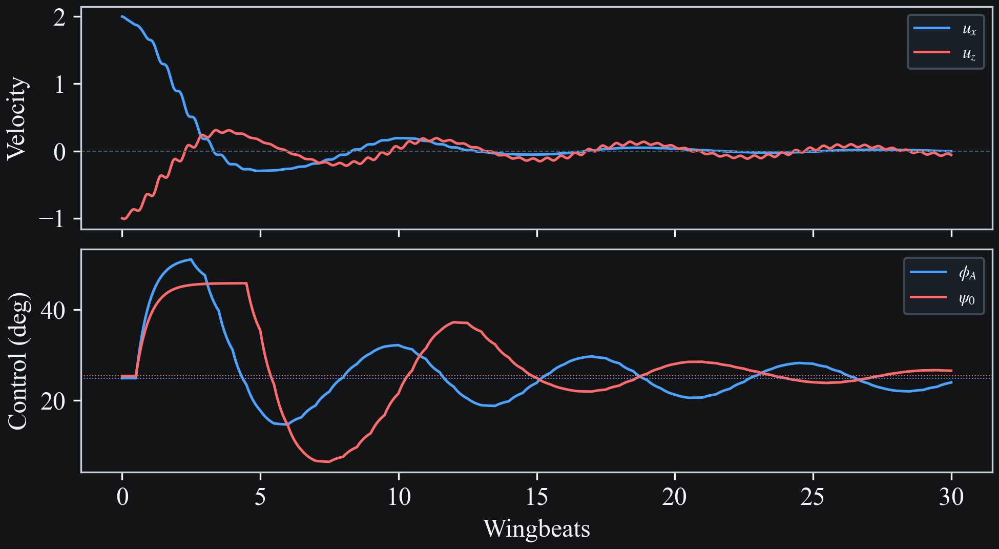

# Hover Solution

```{seealso}
This study builds on the equilibrium velocity analysis in the [Reachability Analysis](reachable.md).
```

## Motivation

A hovering dragonfly must generate a mean aerodynamic force that exactly balances gravity. The stroke plane angle $\gamma_0$ — the inclination of the mean flapping plane from horizontal — determines the direction of the dominant aerodynamic force. For a given $\gamma_0$, the remaining kinematic parameters (stroke amplitude $\phi_A$, mean pitch $\psi_0$, pitch amplitude $\psi_A$, pitch phase $\psi_\varphi$) adjust to satisfy the equilibrium constraint $|\bar{\mathbf{a}}| = 0$.

Among all equilibrium solutions at a given $\gamma_0$, we select the one that minimizes the wingbeat-averaged aerodynamic power $\bar{P}$. Sweeping $\gamma_0$ from 0° (horizontal stroke) to 90° (vertical stroke) yields a curve $\bar{P}(\gamma_0)$ that reveals the energetically optimal stroke plane inclination.

## Approach

The sweep is run via `dragonfly hover -c configs/hover_minpower.yaml`.

For each of the 25 evenly spaced $\gamma_0$ values in $[0°, 90°]$:

1. **Phase 1 — equilibrium search**: `findEquilibria` runs a multi-start (500 Sobol-sampled) COBYLA minimization of $|\bar{\mathbf{a}}|^2$ at $(u_x, u_z) = (0, 0)$, with $\gamma_0$ fixed and the 4 remaining kinematic parameters free.

2. **Phase 2 — power minimization**: For each equilibrium found, COBYLA minimizes $\bar{P} = \frac{1}{T}\int_0^T \sum_i \mathbf{F}_i \cdot \mathbf{v}_{\text{flap},i}\, dt$ subject to $|\bar{\mathbf{a}}|^2 \leq \varepsilon^2$ ($\varepsilon = 10^{-4}$). The branch with lowest $\bar{P}$ is kept.

The power metric uses $\mathbf{F}_{\text{aero}} \cdot \mathbf{v}_{\text{flap}}$ where $\mathbf{v}_{\text{flap}}$ is the flapping velocity (excludes body velocity), consistent with the power required to drive the wings.

### Config: `configs/hover_minpower.yaml`

| Parameter | Value | Notes |
|-----------|-------|-------|
| `omega` | 25.13 (= 8$\pi$) | Nondimensional wingbeat frequency |
| `gamma_sweep` | [0.0, 1.5708, 25] | 0° to 90°, 25 points |
| `phi_amp` | [0.349, 1.396] rad | 20°–80°, variable |
| `psi_mean` | [0.0, 0.785] rad | 0°–45°, variable |
| `psi_amp` | [0.087, 1.047] rad | 5°–60°, variable |
| `psi_phase` | [0.0, 6.283] rad | Full range, variable |
| `gamma_amp`, `gamma_phase`, `phi_mean`, `phi_phase` | 0 | Fixed |
| `n_samples` | 500 | Sobol samples for Phase 1 |
| `max_eval` | 500 | Max evaluations per COBYLA run |
| `equilibrium_tol` | 1×10⁻⁴ | Equilibrium threshold |

## Results

```{raw} html
<div style="margin-bottom:1.5rem;">
  
  <div style="font-size:0.85em; line-height:1.2; margin-top:0.3rem; text-align:center;">Fig. 1. Minimum aerodynamic power as a function of stroke plane angle $\gamma_0$. The dashed line marks the power-minimizing angle.</div>
</div>
```

```{raw} html
<div style="margin-bottom:1.5rem;">
  
  <div style="font-size:0.85em; line-height:1.2; margin-top:0.3rem; text-align:center;">Fig. 2. Optimal control parameters as a function of stroke plane angle $\gamma_0$: stroke amplitude $\phi_A$, mean pitch $\psi_0$, pitch amplitude $\psi_A$, and pitch-flap phase offset $\delta_\psi$.</div>
</div>
```

## Proportional hover controller

The sweep results suggest a simple control scheme for hover stabilization:

1. **$\gamma_0$ = fixed** (set by body anatomy, here 45°)
2. **$\phi_A$ controls $u_z$**: proportional feedback, $\phi_A = \phi_{A,\text{eq}} - K_z \, \bar{u}_z$
3. **$\psi_0$ controls $u_x$**: proportional feedback, $\psi_0 = \psi_{0,\text{eq}} + K_x \, \bar{u}_x$
4. **$\psi_A$ = fixed** at ~57° (near-constant across all $\gamma_0$)
5. **$\delta_\psi$ = fixed** at 90° (also nearly constant)

The equilibrium setpoints $\phi_{A,\text{eq}}$ and $\psi_{0,\text{eq}}$ are found by the optimizer at the chosen $\gamma_0$. The controller then regulates the body velocity to zero using only two control channels.

The controller incorporates two features motivated by the dragonfly sensory-motor system:

- **Rolling average.** The velocity input $\bar{u}$ is averaged over a configurable window (here 0.5 wingbeats), modelling the temporal integration inherent in optic-flow computation.
- **Sensing delay.** The averaged velocity is delayed by 0.25 wingbeats before reaching the controller, reflecting the neural processing latency of the sensorimotor loop.
- **Neuromuscular lag.** The actual commanded values track their targets via a first-order lag with time constant $\tau = 0.5\,T_{\text{wb}}$, modelling finite muscle activation time and thorax/wing compliance. This avoids discontinuous wing position jumps at wingbeat boundaries.

```{raw} html
<div style="margin-bottom:1.5rem;">
  
  <div style="font-size:0.85em; line-height:1.2; margin-top:0.3rem; text-align:center;">Fig. 3. Hover stabilization from $(u_x, u_z) = (2.0, -1.0)$. Top: body velocity (within-wingbeat oscillations are physical). Bottom: control inputs $\phi_A$ and $\psi_0$ with dotted equilibrium lines. Parameters: $K_z = 0.7$, $K_x = 1.2$, averaging window $= 0.5\,T_\text{wb}$, sensing delay $= 0.25\,T_\text{wb}$, muscle lag $\tau = 0.5\,T_\text{wb}$.</div>
</div>
```

```{raw} html
<div style="margin-bottom:1.5rem;">
  <video
    class="case-study-video"
    loop
    autoplay
    muted
    playsinline
    preload="metadata"
    data-light-src="../_static/media/hover/hover_control.light.mp4"
    data-dark-src="../_static/media/hover/hover_control.dark.mp4"
  >
    <source src="../_static/media/hover/hover_control.dark.mp4" type="video/mp4">
    Your browser does not support the video tag.
  </video>
  <div style="font-size:0.85em; line-height:1.2; margin-top:0.3rem; text-align:center;">Fig. 4. 3D animation of hover stabilization. The dragonfly starts with initial velocity $(u_x, u_z) = (2.0, -1.0)$ and converges to hover within ~30 wingbeats.</div>
</div>
```
