# Reachability Analysis

## Overview

We investigate the region of $(\tilde{u}_x, \tilde{u}_z)$ velocity space that the dragonfly can sustain as a steady-state equilibrium by adjusting its wing control parameters. For each point on a regular grid in velocity space, we run a multi-start optimizer to find control parameters that bring the net body force to zero. A grid point is considered reachable if the optimizer achieves a residual below a specified tolerance.

The velocity is nondimensionalized by $\sqrt{gL}$: $\tilde{u}_x$ is the horizontal and $\tilde{u}_z$ is the vertical body velocity. The wing control parameters are:

- $\gamma_0$: stroke plane angle
- $\phi_0$: mean flapping angle
- $\phi_1$: flapping amplitude
- $\psi_0$: mean pitch angle
- $\psi_1$: pitching amplitude
- $\delta_\psi$: pitch-flap phase offset

The flapping phase difference between the hindwing and the forewing does not affect the results here, since the optimizer computes the mean force over one wingbeat assuming constant body velocity. We find that fixing $\phi_0 = \psi_0 = 0$ does not significantly restrict the reachable set, leaving four free parameters: $\gamma_0$, $\phi_1$, $\psi_1$, and $\delta_\psi$.

## Effect of morphological parameters

### Effect of aerodynamic loading

The aerodynamic loading parameter $\mu_0 = \rho S R / m$ is the ratio of the characteristic aerodynamic mass $\rho S R$ to the total dragonfly mass, where $\rho$ is air density, $S$ is the single-wing planform area, and $R$ is the wing span. Fig. 1 shows the reachable set for $\mu_0 = 0.005$, $0.02$, and $0.08$.

```{raw} html
<div style="margin-bottom:1.5rem;">
  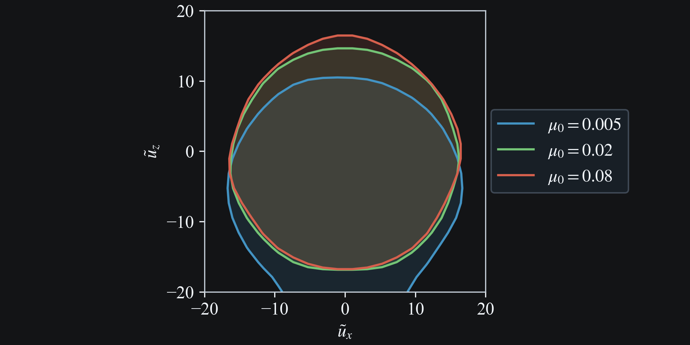
  <div style="font-size:0.85em; line-height:1.2; margin-top:0.3rem; text-align:center;">Fig. 1. Effect of aerodynamic loading parameter $\mu_0$ on the reachable set (4-parameter control).</div>
</div>
```

### Effect of wingbeat frequency

Fig. 2 shows the reachable set for $\omega_0 = 6\pi$, $8\pi$, and $10\pi$.

```{raw} html
<div style="margin-bottom:1.5rem;">
  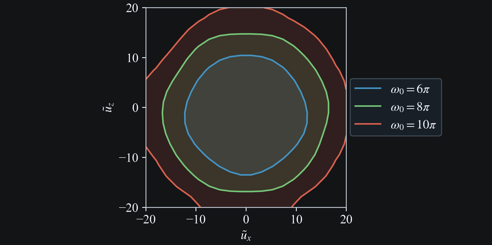
  <div style="font-size:0.85em; line-height:1.2; margin-top:0.3rem; text-align:center;">Fig. 2. Effect of wingbeat frequency $\omega_0$ on the reachable set (4-parameter control).</div>
</div>
```

### Effect of wing span ratio

Fig. 2 shows the reachable set for $\lambda_0 = 0.5$, $0.75$, and $1.0$.

```{raw} html
<div style="margin-bottom:1.5rem;">
  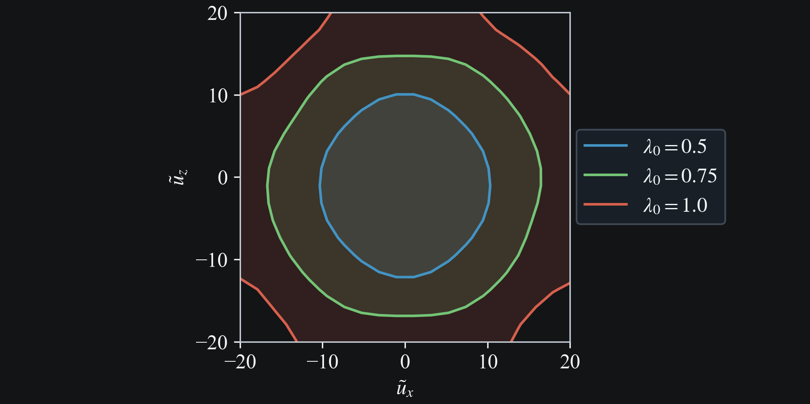
  <div style="font-size:0.85em; line-height:1.2; margin-top:0.3rem; text-align:center;">Fig. 3. Effect of wing span ratio $\lambda_0$ on the reachable set (4-parameter control).</div>
</div>
```

## Effect of wing parameters

### Effect of pitch-flap phase offset

Fixing $\delta_\psi$ to a specific value shifts the reachable set in velocity space. With $\delta_\psi = -\pi/2$ the set shifts toward positive $\tilde{u}_x$ (forward flight); with $\delta_\psi = +\pi/2$ it shifts toward negative $\tilde{u}_x$ (backward flight).

```{raw} html
<div style="margin-bottom:1.5rem;">
  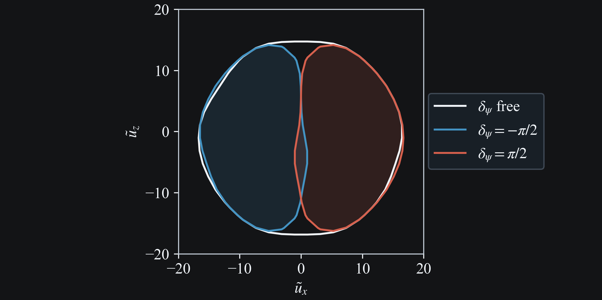
  <div style="font-size:0.85em; line-height:1.2; margin-top:0.3rem; text-align:center;">Fig. 4. Effect of pitch-flap phase offset on the reachable set.</div>
</div>
```

### Effect of stroke plane angle

Restricting the stroke plane angle $\gamma_0$ to $[0, \pi/2]$ (backward tilt) or $[\pi/2, \pi]$ (forward tilt) restricts the reachable set to two quadrants (about $\tilde{u}_z = \tilde{u}_x$ for backward tilt, and about $\tilde{u}_z = -\tilde{u}_x$ for foward tilt).

```{raw} html
<div style="margin-bottom:1.5rem;">
  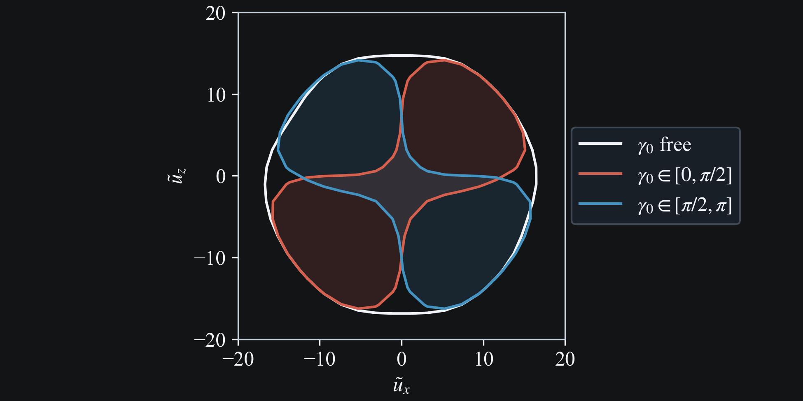
  <div style="font-size:0.85em; line-height:1.2; margin-top:0.3rem; text-align:center;">Fig. 5. Effect of stroke plane angle range on the reachable set.</div>
</div>
```

### Effect of pitching amplitude

Restricting the pitching amplitude $\psi_1$ to below or above $\pi/4$ shows how much pitch authority the dragonfly needs to access different regions of velocity space. Small pitching amplitudes ($\psi_1 < \pi/4$) produce a reduced reachable set, while larger amplitudes ($\psi_1 > \pi/4$) recover most of the full set.

```{raw} html
<div style="margin-bottom:1.5rem;">
  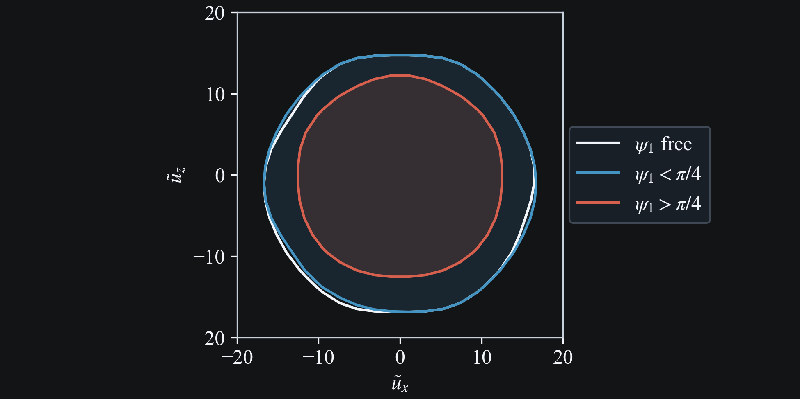
  <div style="font-size:0.85em; line-height:1.2; margin-top:0.3rem; text-align:center;">Fig. 6. Effect of pitching amplitude $\psi_1$ on the reachable set (split at $\psi_1 = \pi/4$).</div>
</div>
```

### Effect of flapping amplitude

Restricting the flapping amplitude $\phi_1$ to below or above $\pi/4$ shows the role of stroke amplitude in covering velocity space. Small amplitudes ($\phi_1 < \pi/4$) yield a much reduced reachable set, while larger amplitudes ($\phi_1 > \pi/4$) recover the full set.

```{raw} html
<div style="margin-bottom:1.5rem;">
  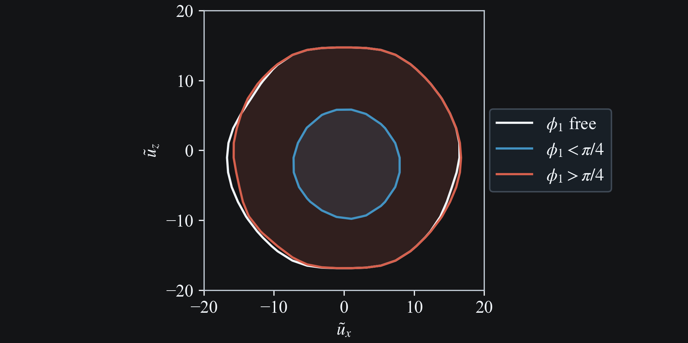
  <div style="font-size:0.85em; line-height:1.2; margin-top:0.3rem; text-align:center;">Fig. 7. Effect of flapping amplitude $\phi_1$ on the reachable set (split at $\phi_1 = \pi/4$).</div>
</div>
```

In Fig. 8, the pitching amplitude is now capped at $\psi_1 \leq \pi/16$.

```{raw} html
<div style="margin-bottom:1.5rem;">
  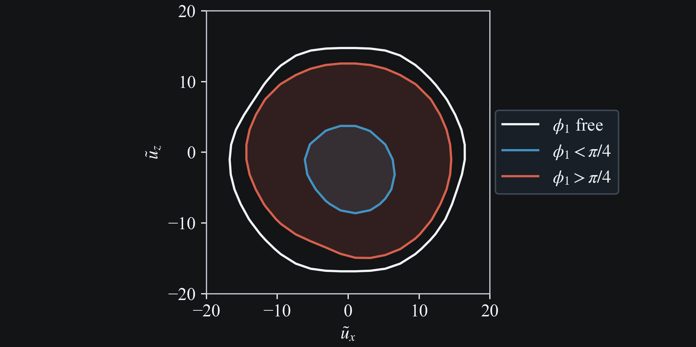
  <div style="font-size:0.85em; line-height:1.2; margin-top:0.3rem; text-align:center;">Fig. 8. Effect of flapping amplitude $\phi_1$ with $\psi_1 \leq \pi/16$ (split at $\phi_1 = \pi/4$).</div>
</div>
```


## Equilibrium Solutions

### Hover $\tilde{u}_x = \tilde{u}_z = 0$

$\phi_1 = 34.9^\circ$, $\psi_1 = 15.9^\circ$, $\delta_\psi = 109.2^\circ$

```{raw} html
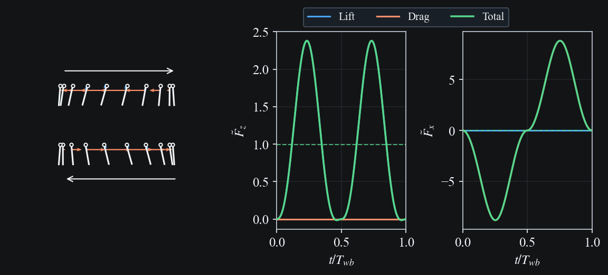
```

$\phi_1 = 59.6^\circ$, $\psi_1 = 16.0^\circ$, $\delta_\psi = 18.6^\circ$

```{raw} html
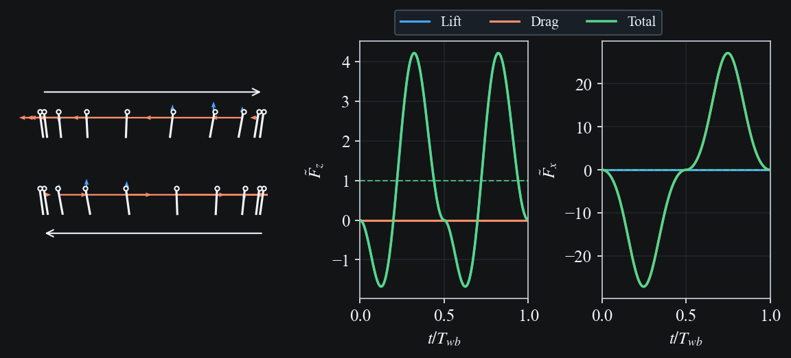
```

$\phi_1 = 28.8^\circ$, $\psi_1 = 37.1^\circ$, $\delta_\psi = 136.0^\circ$

```{raw} html
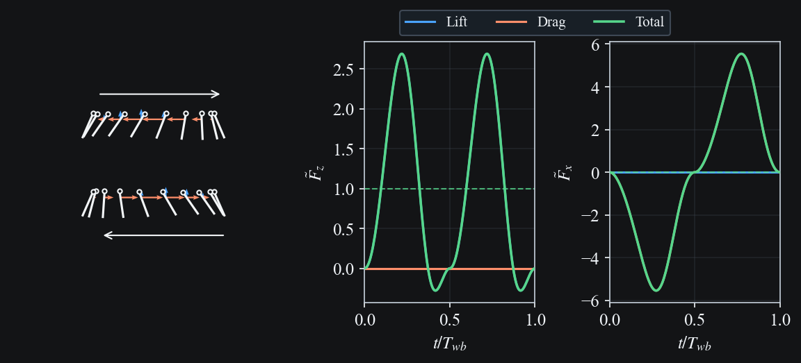
```

$\phi_1 = 40.2^\circ$, $\psi_1 = 88.1^\circ$, $\delta_\psi = 24.5^\circ$

```{raw} html
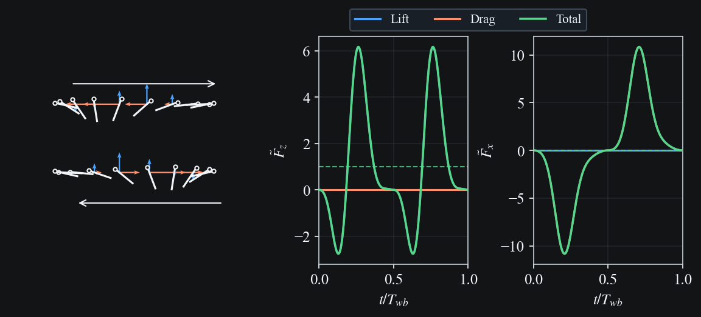
```

### Slow Forward Climb $\tilde{u}_x = 1$, $\tilde{u}_z = 1$

$\gamma_0 = 22.1^\circ$, $\phi_1 = 32.8^\circ$, $\psi_1 = 68.6^\circ$, $\delta_\psi = 124.5^\circ$

```{raw} html
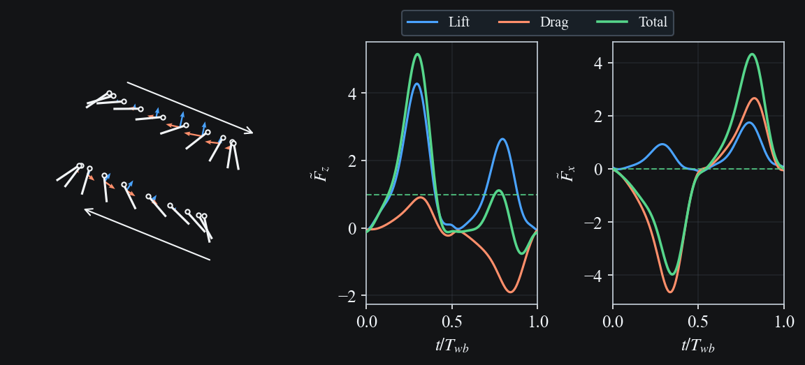
```

$\gamma_0 = 23.8^\circ$, $\phi_1 = 37.8^\circ$, $\psi_1 = 75.5^\circ$, $\delta_\psi = 137.5^\circ$

```{raw} html
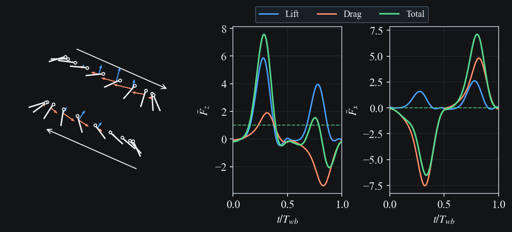
```

$\gamma_0 = 27.7^\circ$, $\phi_1 = 30.8^\circ$, $\psi_1 = 30.0^\circ$, $\delta_\psi = 46.7^\circ$

```{raw} html
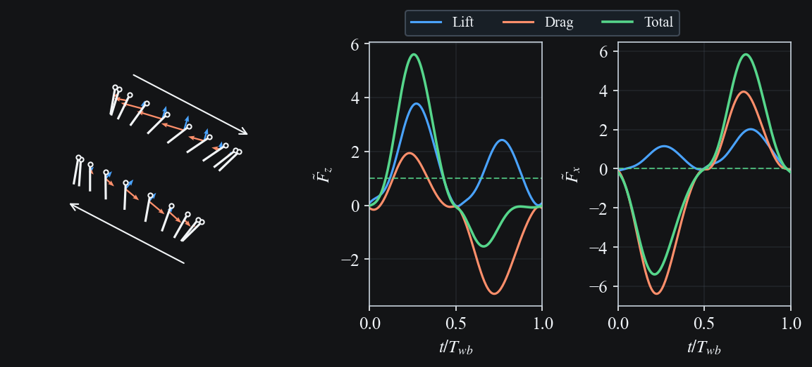
```

### Reachability Boundary

**Fast descent, small forward component** ($\tilde{u}_x = 3.16$, $\tilde{u}_z = -15.79$)

$\gamma_0 = 168.2^\circ$, $\phi_1 = 85.9^\circ$, $\psi_1 = 34.2^\circ$, $\delta_\psi = 96.4^\circ$

```{raw} html
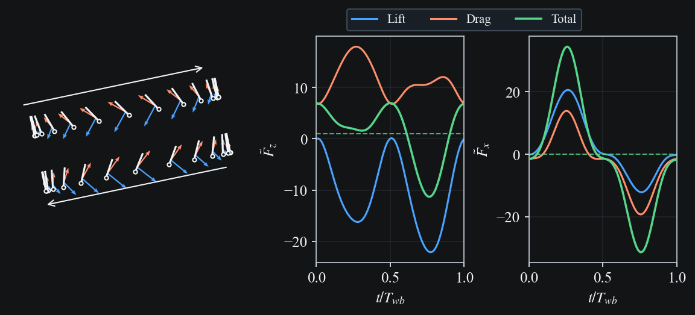
```

**Slow descent, large forward component** ($\tilde{u}_x = 13.68$, $\tilde{u}_z = -5.26$)

$\gamma_0 = 108.4^\circ$, $\phi_1 = 83.9^\circ$, $\psi_1 = 37.4^\circ$, $\delta_\psi = 90.7^\circ$

```{raw} html
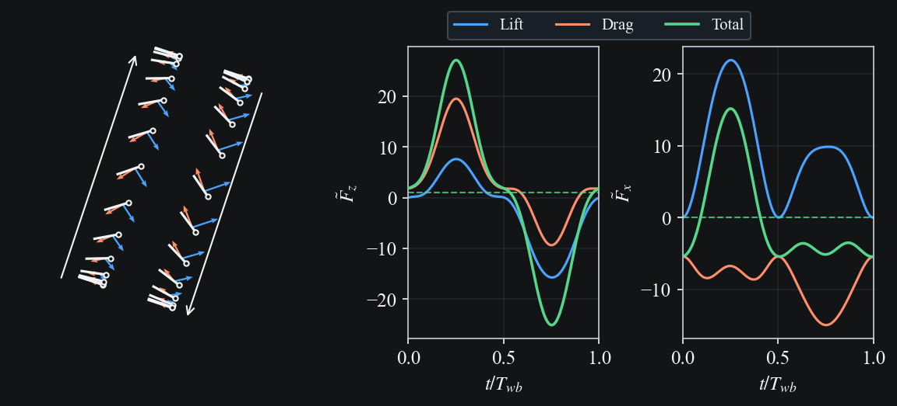
```

**Slow climb, large forward component** ($\tilde{u}_x = 13.68$, $\tilde{u}_z = 5.26$)

$\gamma_0 = 66.5^\circ$, $\phi_1 = 85.9^\circ$, $\psi_1 = 36.4^\circ$, $\delta_\psi = 91.4^\circ$

```{raw} html
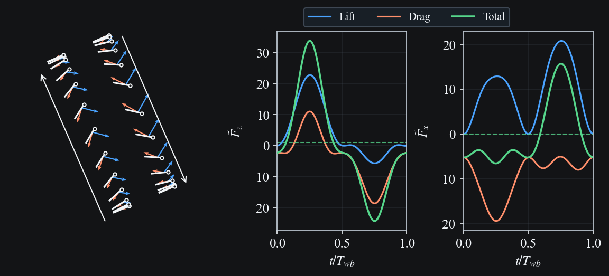
```

**Fast climb, small forward component** ($\tilde{u}_x = 3.16$, $\tilde{u}_z = 13.68$)

$\gamma_0 = 12.4^\circ$, $\phi_1 = 83.8^\circ$, $\psi_1 = 35.0^\circ$, $\delta_\psi = 88.4^\circ$

```{raw} html
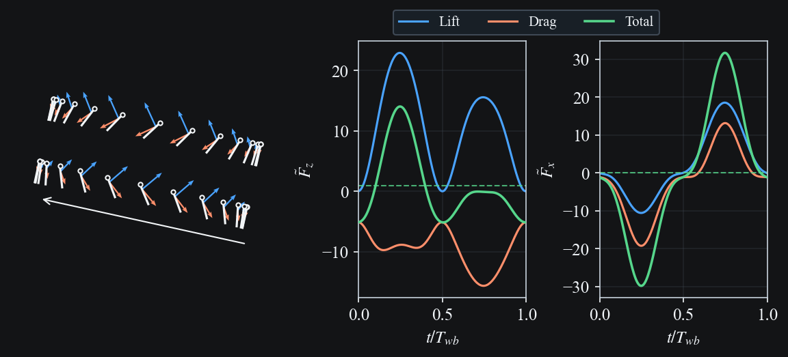
```

## Reproduction Commands

```bash
# Regenerate docs media for this case
python -m scripts.docs_media_runner cases/reachable/post.yaml

# Re-run hover optimizer at (ux, uz) = (0, 0) and regenerate case YAMLs
build/bin/dragonfly reachable -c docs/research/reachable/artifacts/reachable_run_hover_zero.yaml
python cases/reachable_hover/gen_cases.py

# Re-run slow climb optimizer at (ux, uz) = (0, 1) and regenerate case YAMLs
build/bin/dragonfly reachable -c docs/research/reachable/artifacts/reachable_run_climb_slow.yaml
python cases/reachable_climb/gen_cases.py

# Re-run forward climb optimizer at (ux, uz) = (1, 1) and regenerate case YAMLs
build/bin/dragonfly reachable -c docs/research/reachable/artifacts/reachable_run_climb_forward.yaml
python cases/reachable_climb_forward/gen_cases.py

# Regenerate hover, climb, and boundary solution media
python -m scripts.docs_media_runner cases/reachable_hover/post.yaml
python -m scripts.docs_media_runner cases/reachable_climb/post.yaml
python -m scripts.docs_media_runner cases/reachable_climb_forward/post.yaml

# Select four boundary points, run branch simulations, pick best, write case YAMLs
python cases/reachable_boundary/gen_cases.py
# Then regenerate boundary media
python -m scripts.docs_media_runner cases/reachable_boundary/post.yaml
```
