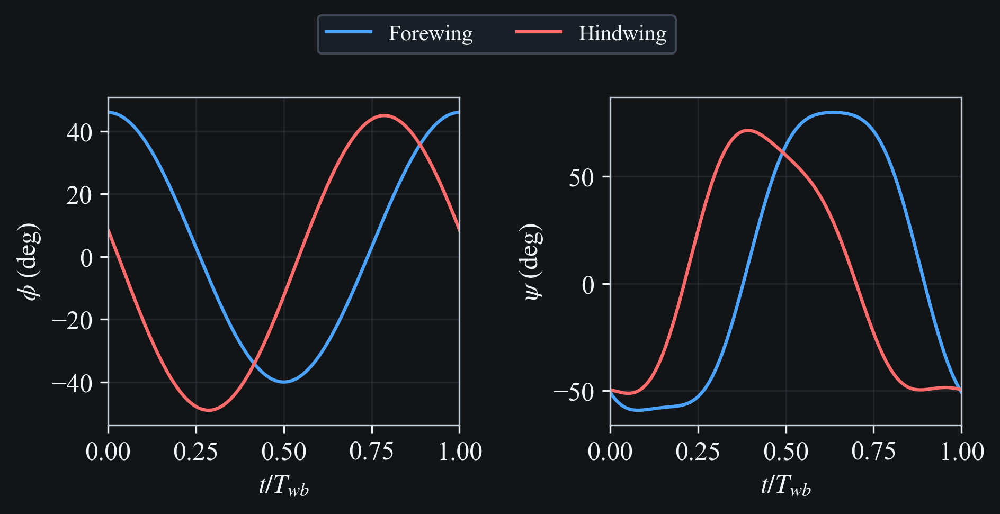
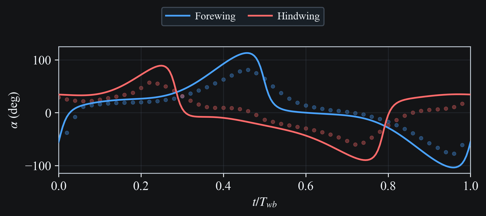
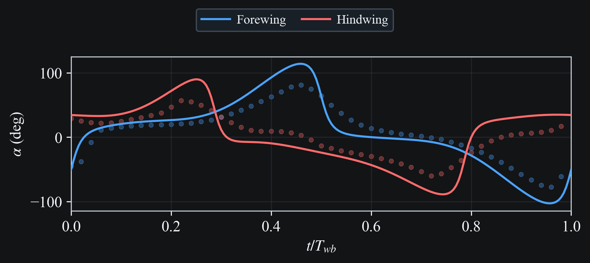
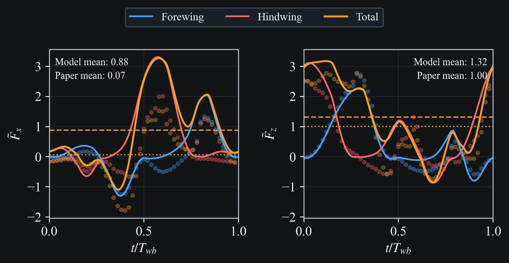

# Azuma and Azuma 1985

## Case and data description

The goal of this case study is to validate the simulation against the forward flight condition measured in {cite}`azuma1985`. The paper provides Fourier harmonic fits to measured wing kinematics, which are used directly as simulation inputs. The wing kinematics correspond to a steady-state flight condition with body velocity magnitude $U = 0.54$ m/s and direction $\theta = 60°$ from the horizontal. Here we run a tethered simulation for one wingbeat with the body velocity fixed to the experimental condition, nondimensionalized as $U^* = U/\sqrt{gL} = 0.862$ (with $L = 40$ mm), and decompose it into $u_x^* = 0.431$ and $u_z^* = 0.747$.

Morphology data for the specimen are taken directly from the paper (Table 1).

```{raw} html
<div style="font-size:0.85em; line-height:1.2; margin-bottom:0.3rem; margin-top:1.5rem; text-align:center;">Table 1. Specimen morphology.</div>
```

| Quantity | Value |
|--|------:|
| Body length $L$ (mm) | 40 |
| Body mass $m$ (mg) | 260 |
| Forewing span $R_f$ (mm) | 33.5 |
| Forewing area $S_f$ (mm²) | 221 |
| Hindwing span $R_h$ (mm) | 32.5 |
| Hindwing area $S_h$ (mm²) | 272 |
| Flapping frequency $f$ (Hz) | 41.5 |

## Wing kinematics

Fourier harmonic coefficients from curve fits of the flapping angle and pitch angle of each wing pair are given with the convention

$$
\begin{aligned}
\phi^{\text{(paper)}}(t) &= -\phi(t) \\
\psi^{\text{(paper)}}(t) &= \psi(t) + 90^\circ
\end{aligned}
$$

which we correct for. The $\phi(t)$ and $\psi(t)$ time series are shown in Fig. 1. The corresponding harmonic coefficients are listed in Tables 2 and 3. The stroke plane and coning angles are listed in Table 4.

```{raw} html
<div style="margin-bottom:1.5rem;">
  
  <div style="font-size:0.85em; line-height:1.2; margin-top:0.3rem; text-align:center;">Fig. 1. Wing kinematics.</div>
</div>
```

```{raw} html
<div style="font-size:0.85em; line-height:1.2; margin-bottom:0.3rem; text-align:center;">Table 2. Flapping angle harmonic coefficients (degrees).</div>
```

|          | $\phi_0$ | $\phi_1$ | $\delta_1$ |
|----------|-----:|-----:|------:|
| Forewing | 3    | 43   | 0     |
| Hindwing | -2   | 47   | 77    |

```{raw} html
<div style="font-size:0.85em; line-height:1.2; margin-bottom:0.3rem; margin-top:1.5rem; text-align:center;">Table 3. Pitching angle harmonic coefficients (degrees).</div>
```

|          | $\psi_0$ | $\psi_1$ | $\psi_2$ | $\psi_3$ | $\delta_1$ | $\delta_2$ | $\delta_3$ |
|----------|-----:|-----:|-----:|-----:|------:|------:|------:|
| Forewing |  8   | -77  | -3   | -8   | -49   | 67    | 29    |
| Hindwing |  3   | -65  |  8   |  8   |  18   | 74    | 28    |

```{raw} html
<div style="font-size:0.85em; line-height:1.2; margin-bottom:0.3rem; text-align:center;">Table 4. Stroke plane and coning angles (degrees).</div>
```

|          | $\gamma$ | $\beta$ |
|----------|-----:|-----:|
| Forewing | 37   | 8   |
| Hindwing | 40   | -2  |

## Results

```{raw} html
<div style="margin-bottom:1.5rem;">
  <video
    class="case-study-video"
    loop
    autoplay
    muted
    playsinline
    preload="metadata"
    data-light-src="../_static/media/azuma1985/simulation.light.mp4"
    data-dark-src="../_static/media/azuma1985/simulation.dark.mp4"
  >
    <source src="../_static/media/azuma1985/simulation.dark.mp4" type="video/mp4">
    Your browser does not support the video tag.
  </video>
  <div style="font-size:0.85em; line-height:1.2; margin-top:0.3rem; text-align:center;">Fig. 2. 3D wing motion.</div>
</div>
```

```{raw} html
<div style="margin-bottom:1.5rem;">
  <video
    class="case-study-video"
    loop
    autoplay
    muted
    playsinline
    preload="metadata"
    data-light-src="../_static/media/azuma1985/stick.light.mp4"
    data-dark-src="../_static/media/azuma1985/stick.dark.mp4"
  >
    <source src="../_static/media/azuma1985/stick.dark.mp4" type="video/mp4">
    Your browser does not support the video tag.
  </video>
  <div style="font-size:0.85em; line-height:1.2; margin-top:0.3rem; text-align:center;">Fig. 3. Stick plot.</div>
</div>
```

Fig. 4 shows angle of attack over one wingbeat at the $0.75R$ (3/4-span) station assuming constant velocity. Angle of attack data from the paper is shown for comparison. The paper data is obtained with a so-called Local Circulation Method which computes an induced velocity field to account for wake effects, which explains the discrepancy. To validate the raw angle of attack calculation (zero induced velocity) the model result is compared to a simplified expression for angle of attack which assumes the velocity is normal to the stroke plane, and the coning angle is zero:

$$\alpha(r) \approx \psi - \pi/2 + \tan^{-1}{\left(\frac{U}{r\dot{\phi}}\right)}$$

Where $r$ is the distance from the wing root along the span, set here to $0.75R$. It it clear that the misalignement of the stroke plane and velocity vector, as well as the non-zero coning angle, have only a very small effect on the result.

::::{tab-set}
:::{tab-item} Model
```{raw} html
<div style="margin-bottom:0.3rem;">
  
</div>
```
:::
:::{tab-item} Simplified Expression
```{raw} html
<div style="margin-bottom:0.3rem;">
  
</div>
```
:::
::::

```{raw} html
<div style="font-size:0.85em; line-height:1.2; margin-top:0.3rem; margin-bottom:1.5rem; text-align:center;">Fig. 4. Angle of attack over one wingbeat.</div>
```

Fig. 5 shows the horizontal and vertical aerodynamic force components over one wingbeat, including the forewing and hindwing contributions. Because we neglect the induced velocity in the model, the mean force, especially the horizontal component, is significantly higher than the paper results, which account for induced velocity effects.

```{raw} html
<div style="margin-bottom:1.5rem;">
  
  <div style="font-size:0.85em; line-height:1.2; margin-top:0.3rem; text-align:center;">Fig. 5. Horizontal and vertical aerodynamic force components over one wingbeat.</div>
</div>
```

## Reproduction Commands

```bash
# Regenerate docs media for this case
python -m scripts.docs_media_runner --run-all --only azuma1985
```

## References

```{bibliography}
:filter: docname in docnames
```
