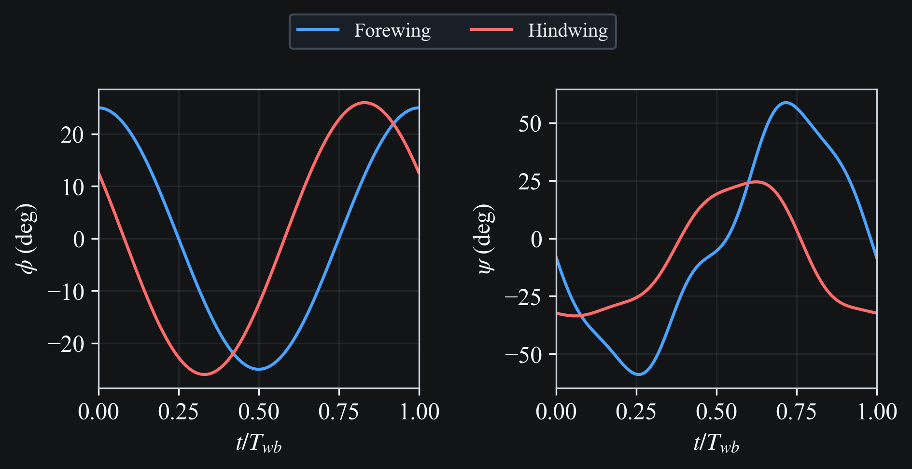
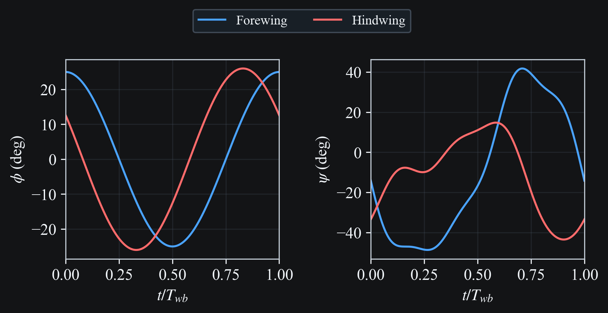

# Azuma and Watanabe 1988

Flight simulation from experimental wing kinematics from {cite}`azuma1988`.

This page renders media for experiments `1`-`4` (Dragonfly A/B).

## Description

### Dragonfly Specimen

| Parameter | Value |
|---|---|
| Body length $L$ | `0.075 m` |
| Body mass $m$ | `7.900e-04 kg` |
| Forewing span $R_{fw}$ | `0.05 m` |
| Forewing area $S_{fw}$ | `5.000e-04 m^2` |
| Hindwing span $R_{hw}$ | `0.0485 m` |
| Hindwing area $S_{hw}$ | `6.000e-04 m^2` |

Coning angles (shared across experiments):
- Fore: `8 deg`
- Hind: `-2 deg`

### Experiments Summary

| Experiment | Dragonfly | Frequency (Hz) | Fore gamma (deg) | Hind gamma (deg) | Reference flight condition |
|---|---|---:|---:|---:|---|
| 1 | A | 26.5 | 40 | 38 | speed `0.7 m/s`, direction `-12 deg` |
| 2 | A | 28.1 | 55 | 48 | speed `1.5 m/s`, direction `-1.1 deg` |
| 3 | A | 29 | 58 | 52 | speed `2.3 m/s`, direction `4.8 deg` |
| 4 | B | 27 | 63 | 68 | speed `3.2 m/s`, direction `0 deg` |

## Pre-processing

The simulator motion inputs are constructed from the paper angles using:

- `phi_sim = -psi_paper` (sign flip)
- `psi_sim = theta_paper - 90 deg`

## Experiment 1 (Dragonfly A)

### Kinematics

```{raw} html

```

### Wing Motion 3D Visualization

```{raw} html
<video
  class="case-study-video"
  controls
  loop
  autoplay
  muted
  preload="metadata"
  data-light-src="../_static/media/azuma1988/exp1/simulation.light.mp4"
  data-dark-src="../_static/media/azuma1988/exp1/simulation.dark.mp4"
>
  <source src="../_static/media/azuma1988/exp1/simulation.dark.mp4" type="video/mp4">
  Your browser does not support the video tag.
</video>
```

### Wing Motion Stick Plot

```{raw} html
<video
  class="case-study-video"
  controls
  loop
  autoplay
  muted
  preload="metadata"
  data-light-src="../_static/media/azuma1988/exp1/stick.light.mp4"
  data-dark-src="../_static/media/azuma1988/exp1/stick.dark.mp4"
>
  <source src="../_static/media/azuma1988/exp1/stick.dark.mp4" type="video/mp4">
  Your browser does not support the video tag.
</video>
```

### Body Speed and Direction

```{raw} html

```

## Experiment 2 (Dragonfly A)

### Kinematics

```{raw} html

```

### Wing Motion 3D Visualization

```{raw} html
<video
  class="case-study-video"
  controls
  loop
  autoplay
  muted
  preload="metadata"
  data-light-src="../_static/media/azuma1988/exp2/simulation.light.mp4"
  data-dark-src="../_static/media/azuma1988/exp2/simulation.dark.mp4"
>
  <source src="../_static/media/azuma1988/exp2/simulation.dark.mp4" type="video/mp4">
  Your browser does not support the video tag.
</video>
```

### Wing Motion Stick Plot

```{raw} html
<video
  class="case-study-video"
  controls
  loop
  autoplay
  muted
  preload="metadata"
  data-light-src="../_static/media/azuma1988/exp2/stick.light.mp4"
  data-dark-src="../_static/media/azuma1988/exp2/stick.dark.mp4"
>
  <source src="../_static/media/azuma1988/exp2/stick.dark.mp4" type="video/mp4">
  Your browser does not support the video tag.
</video>
```

### Body Speed and Direction

```{raw} html

```

## Experiment 3 (Dragonfly A)

### Kinematics

```{raw} html

```

### Wing Motion 3D Visualization

```{raw} html
<video
  class="case-study-video"
  controls
  loop
  autoplay
  muted
  preload="metadata"
  data-light-src="../_static/media/azuma1988/exp3/simulation.light.mp4"
  data-dark-src="../_static/media/azuma1988/exp3/simulation.dark.mp4"
>
  <source src="../_static/media/azuma1988/exp3/simulation.dark.mp4" type="video/mp4">
  Your browser does not support the video tag.
</video>
```

### Wing Motion Stick Plot

```{raw} html
<video
  class="case-study-video"
  controls
  loop
  autoplay
  muted
  preload="metadata"
  data-light-src="../_static/media/azuma1988/exp3/stick.light.mp4"
  data-dark-src="../_static/media/azuma1988/exp3/stick.dark.mp4"
>
  <source src="../_static/media/azuma1988/exp3/stick.dark.mp4" type="video/mp4">
  Your browser does not support the video tag.
</video>
```

### Body Speed and Direction

```{raw} html

```

## Experiment 4 (Dragonfly B)

### Kinematics

```{raw} html

```

### Wing Motion 3D Visualization

```{raw} html
<video
  class="case-study-video"
  controls
  loop
  autoplay
  muted
  preload="metadata"
  data-light-src="../_static/media/azuma1988/exp4/simulation.light.mp4"
  data-dark-src="../_static/media/azuma1988/exp4/simulation.dark.mp4"
>
  <source src="../_static/media/azuma1988/exp4/simulation.dark.mp4" type="video/mp4">
  Your browser does not support the video tag.
</video>
```

### Wing Motion Stick Plot

```{raw} html
<video
  class="case-study-video"
  controls
  loop
  autoplay
  muted
  preload="metadata"
  data-light-src="../_static/media/azuma1988/exp4/stick.light.mp4"
  data-dark-src="../_static/media/azuma1988/exp4/stick.dark.mp4"
>
  <source src="../_static/media/azuma1988/exp4/stick.dark.mp4" type="video/mp4">
  Your browser does not support the video tag.
</video>
```

### Body Speed and Direction

```{raw} html

```

### Pitch Angle Along Span and Wingbeat

Pitch angle over one wingbeat of constant-velocity flight, viewed normal to the
stroke plane, for the forewing (above) and hindwing (below)

```{raw} html

```

```{raw} html

```

## Reproduction Commands

```bash
# Regenerate docs media for all Azuma 1988 experiments
python -m scripts.docs_media_runner --run-all --only azuma1988

# Or one experiment at a time
python -m scripts.docs_media_runner --run-all --only azuma1988_exp1
python -m scripts.docs_media_runner --run-all --only azuma1988_exp2
python -m scripts.docs_media_runner --run-all --only azuma1988_exp3
python -m scripts.docs_media_runner --run-all --only azuma1988_exp4
```

## References

```{bibliography}
:filter: docname in docnames
```
