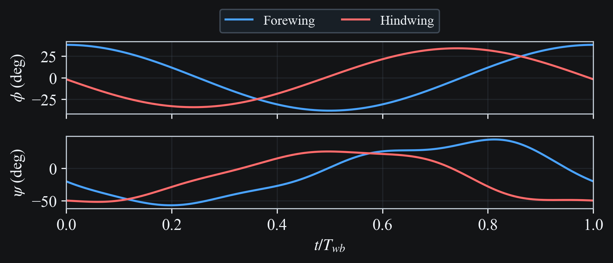
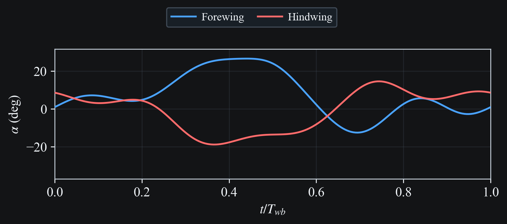
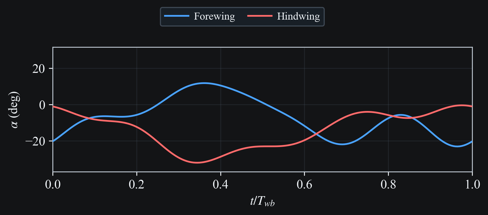
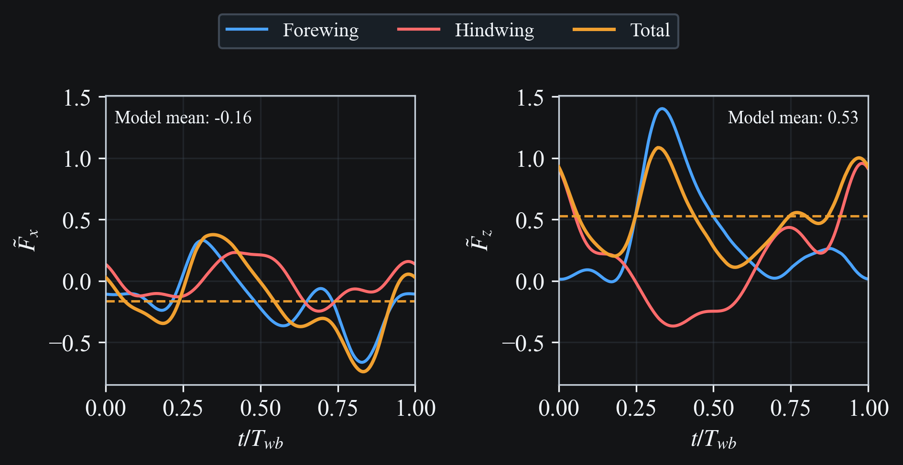

# Azuma and Watanabe 1988: Experiment 4 (Dragonfly B)

## Results

```{raw} html
<div style="margin-bottom:1.5rem;">
  
  <div style="font-size:0.85em; line-height:1.2; margin-top:0.3rem; text-align:center;">Fig. 1. Experiment 4 wing kinematics.</div>
</div>
```

```{raw} html
<div style="margin-bottom:1.5rem;">
  <video
    class="case-study-video"
    loop
    autoplay
    muted
    playsinline
    preload="metadata"
    data-light-src="../../_static/media/azuma1988/exp4/simulation.light.mp4"
    data-dark-src="../../_static/media/azuma1988/exp4/simulation.dark.mp4"
  >
    <source src="../../_static/media/azuma1988/exp4/simulation.dark.mp4" type="video/mp4">
    Your browser does not support the video tag.
  </video>
  <div style="font-size:0.85em; line-height:1.2; margin-top:0.3rem; text-align:center;">Fig. 2. Experiment 4 3D wing motion.</div>
</div>
```

```{raw} html
<div style="margin-bottom:1.5rem;">
  <video
    class="case-study-video"
    loop
    autoplay
    muted
    playsinline
    preload="metadata"
    data-light-src="../../_static/media/azuma1988/exp4/stick.light.mp4"
    data-dark-src="../../_static/media/azuma1988/exp4/stick.dark.mp4"
  >
    <source src="../../_static/media/azuma1988/exp4/stick.dark.mp4" type="video/mp4">
    Your browser does not support the video tag.
  </video>
  <div style="font-size:0.85em; line-height:1.2; margin-top:0.3rem; text-align:center;">Fig. 3. Experiment 4 stick plot.</div>
</div>
```

::::{tab-set}
:::{tab-item} Model
```{raw} html
<div style="margin-bottom:0.3rem;">
  
</div>
```
:::
:::{tab-item} Simplified Expression
```{raw} html
<div style="margin-bottom:0.3rem;">
  
</div>
```
:::
::::

```{raw} html
<div style="font-size:0.85em; line-height:1.2; margin-top:0.3rem; margin-bottom:1.5rem; text-align:center;">Fig. 4. Experiment 4 angle of attack over one wingbeat.</div>
```

```{raw} html
<div style="margin-bottom:1.5rem;">
  
  <div style="font-size:0.85em; line-height:1.2; margin-top:0.3rem; text-align:center;">Fig. 5. Experiment 4 horizontal and vertical aerodynamic force components over one wingbeat.</div>
</div>
```
