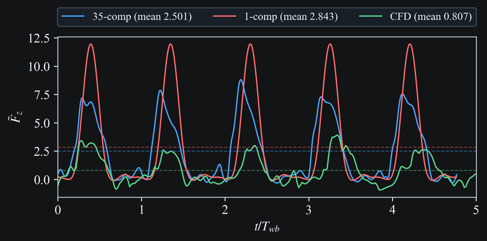

# Wang and Russell 2007

This case study runs tethered simulations using wing kinematics derived from {cite}`wang2007`.
A high-fidelity Fourier representation using 7 harmonics per wingbeat
(35 Fourier components over 5 wingbeats) is compared to a single harmonic representation.

Pipeline stages: `sim -> post`

## Key Parameters

- `omega`: `15.713508913351`
- `lb0`: `0.818181818182`
- `mu0`: `0.064312500000`
- `harmonics_per_wingbeat`: `7`
- `fourier_components`: `35`
- `n_wingbeats`: `5`
- `steps_per_wingbeat`: `200`

## Pre-processing

### Kinematics

```{raw} html

```

## Results

### Wing Motion 3D Visualization

```{raw} html
<video
  class="case-study-video"
  controls
  loop
  autoplay
  muted
  preload="metadata"
  data-light-src="../_static/media/wang2007/simulation.light.mp4"
  data-dark-src="../_static/media/wang2007/simulation.dark.mp4"
>
  <source src="../_static/media/wang2007/simulation.dark.mp4" type="video/mp4">
  Your browser does not support the video tag.
</video>
```

### Wing Motion Stick Plot

```{raw} html
<video
  class="case-study-video"
  controls
  loop
  autoplay
  muted
  preload="metadata"
  data-light-src="../_static/media/wang2007/stroke_fore_left.light.mp4"
  data-dark-src="../_static/media/wang2007/stroke_fore_left.dark.mp4"
>
  <source src="../_static/media/wang2007/stroke_fore_left.dark.mp4" type="video/mp4">
  Your browser does not support the video tag.
</video>
```

### Force Comparison

The plot overlays simulation force traces with the external CFD reference from
`data/kinematics/wang2007/cfd_data.csv`.

```{raw} html

```

## Reproduction Commands

```bash
# Regenerate docs media for this case
python -m scripts.docs_media_runner --run-all --only wang2007
```

## References

```{bibliography}
:filter: docname in docnames
```
