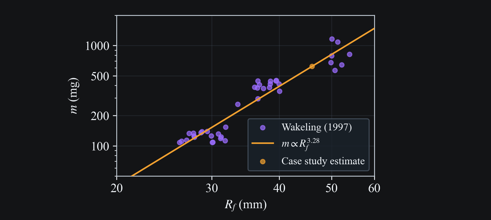
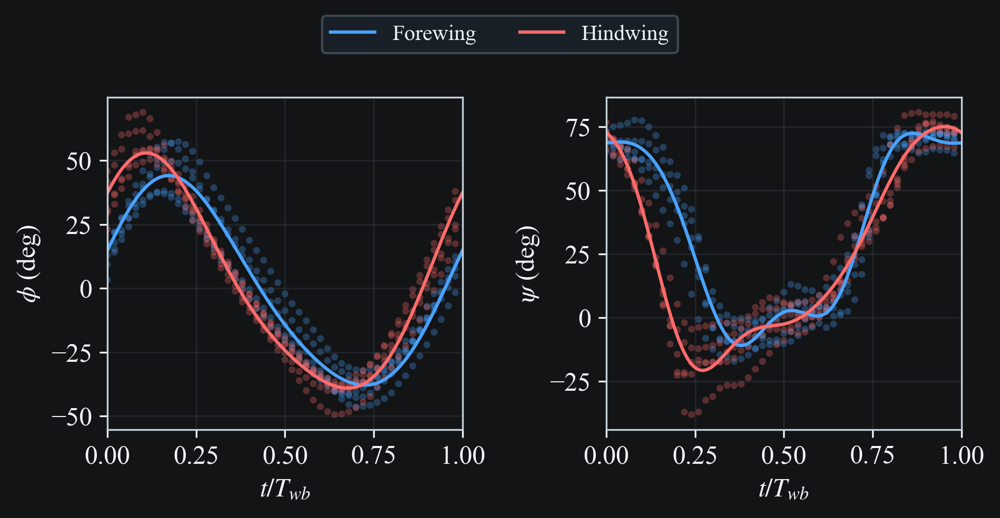

# Wang and Russell 2007

## Case and data description

The goal of this case study is to validate the aerodynamic calculation against CFD results obtained from experimental wing kinematics. Smoothed wing motion data and CFD wing force data from a tethered dragonfly experiment were extracted from line plots in {cite}`wang2007` using WebPlotDigitizer. The wing pitching angles $\psi$ are given directly (with a different convention), but not the flapping angles. Instead, we have position data for the 2/3 span station of each wing as seen from the side of the dragonfly. The coordinate system is aligned with the stroke plane, such that there is a coordinate $s$ along the stroke plane, and a coordinate $d$ normal to the stroke plane. The stroke plane angles $\gamma$ are also given.

Morphology data for the dragonfly specimen is limited, only the chord length at 2/3 span is given as 10.3 mm. Using a reference image of *Libellula Pulchela* and the given chord length, we obtained the remaining dimensions assuming the proportions were the same as the specimen used in the experiment (Table 1). The mass was estimated from a power-law regression $m \propto L^n$, with $L$ the body length, fitted to samples from {cite}`wakeling1997`, giving approximately 350 mg (Fig. 1).

```{raw} html
<div style="font-size:0.85em; line-height:1.2; margin-bottom:0.3rem; margin-top:1.5rem; text-align:center;">Table 1. Specimen morphology.</div>
```

| Quantity | Value |
|--|------:|
| Body length $L$ (mm) | 51 |
| Body mass $m$ (mg) | 350 |
| Forewing span $R_f$ (mm) | 46 |
| Forewing area $S_f$ (mm²) | 380 |
| Hindwing span $R_h$ (mm) | 43 |
| Hindwing area $S_h$ (mm²) | 440 |
| Flapping frequency $f$ (Hz) | 33.4 |
| Forewing stroke angle $\gamma_f$ (deg) | 53 |
| Hindwing stroke angle $\gamma_h$ (deg) | 44 |

```{raw} html
<div style="margin-bottom:1.5rem;">
  
  <div style="font-size:0.85em; line-height:1.2; margin-top:0.3rem; text-align:center;">Fig. 1. Mass estimation from body length.</div>
</div>
```

## Wing kinematics extraction

The coordinate $s(t)$ along the stroke plane is the result of the projection

$$
s(t) = R \cos{\beta(t)} \sin{\phi(t)}
$$

where $R$ is the wing length. For $|\beta| \lesssim 10^\circ$, $\cos{\beta}$ can be set to 1, and the flapping angle is simply

$$
\phi(t) = \sin^{-1}{\left( \frac{s(t)}{R} \right)}
$$

The coordinate normal to the stroke plane, $d(t)$, has a small amplitude, so it is neglected here.

Finally, the pitch angle is given with the convention $\psi^{\text{(paper)}}(t) = 90^\circ - \psi(t)$, which we correct for.

The five periods of the $\phi$ and $\psi$ data are shown in Fig. 2. Harmonic series are fitted to the wingbeat average of the data, using 2 harmonics for $\phi$, and 4 harmonics for $\psi$. The fit parameters are given in Table 2 and Table 3.

```{raw} html
<div style="margin-bottom:1.5rem;">
  
  <div style="font-size:0.85em; line-height:1.2; margin-top:0.3rem; text-align:center;">Fig. 2. Digitized experimental data (scatter) and fitted harmonics (lines).</div>
</div>
```

```{raw} html
<div style="font-size:0.85em; line-height:1.2; margin-bottom:0.3rem; text-align:center;">Table 2. Flapping angle harmonic coefficients (degrees).</div>
```

|          | $\phi_0$ | $\phi_1$ | $\phi_2$ | $\delta_1$ | $\delta_2$ |
|----------|-----:|-----:|-----:|------:|------:|
| Forewing |    0 |   26 |    3 |  -69 |  -89 |
| Hindwing |    1 |   28 |    4 |  -47 |  -50 |

```{raw} html
<div style="font-size:0.85em; line-height:1.2; margin-bottom:0.3rem; text-align:center;">Table 3. Pitching angle harmonic coefficients (degrees).</div>
```

|          | $\psi_0$ | $\psi_1$ | $\psi_2$ | $\psi_3$ | $\psi_4$ | $\delta_1$ | $\delta_2$ | $\delta_3$ | $\delta_4$ |
|----------|-----:|-----:|-----:|-----:|-----:|------:|------:|------:|------:|
| Forewing |   34 |   43 |    1 |    9 |    2 |   13 |  -97 | -167 |  -24 |
| Hindwing |   24 |   44 |   14 |    5 |    2 |   35 |   23 |  -73 | -144 |

## Results

```{raw} html
<div style="margin-bottom:1.5rem;">
  <video
    class="case-study-video"
    loop
    autoplay
    muted
    playsinline
    preload="metadata"
    data-light-src="../_static/media/wang2007/simulation.light.mp4"
    data-dark-src="../_static/media/wang2007/simulation.dark.mp4"
  >
    <source src="../_static/media/wang2007/simulation.dark.mp4" type="video/mp4">
    Your browser does not support the video tag.
  </video>
  <div style="font-size:0.85em; line-height:1.2; margin-top:0.3rem; text-align:center;">Fig. 3. 3D wing motion.</div>
</div>
```

```{raw} html
<div style="margin-bottom:1.5rem;">
  <video
    class="case-study-video"
    loop
    autoplay
    muted
    playsinline
    preload="metadata"
    data-light-src="../_static/media/wang2007/stroke_fore_left.light.mp4"
    data-dark-src="../_static/media/wang2007/stroke_fore_left.dark.mp4"
  >
    <source src="../_static/media/wang2007/stroke_fore_left.dark.mp4" type="video/mp4">
    Your browser does not support the video tag.
  </video>
  <div style="font-size:0.85em; line-height:1.2; margin-top:0.3rem; text-align:center;">Fig. 4. Stick plot.</div>
</div>
```

The vertical projection of the total aerodynamic force, normalized by the dragonfly weight, was computed and is compared to the result from {cite}`wang2007`, obtained by extrapolating 2D CFD results to 3D using blade element theory, in Fig. 5. The mean nondimensional force over one wingbeat is 0.744 for the model and 0.807 for the CFD. There is general agreement for the set of parameters used. Shown as dashed lines is the force for 0.5x and 1.5x the mass, which is the parameter with the greatest uncertainty.

```{raw} html
<div style="margin-bottom:1.5rem;">
  
  <div style="font-size:0.85em; line-height:1.2; margin-top:0.3rem; text-align:center;">Fig. 5. Vertical aerodynamic force comparison.</div>
</div>
```

## Reproduction Commands

```bash
# Regenerate docs media for this case
python -m scripts.docs_media_runner --run-all --only wang2007
```

## References

```{bibliography}
:filter: docname in docnames
```
